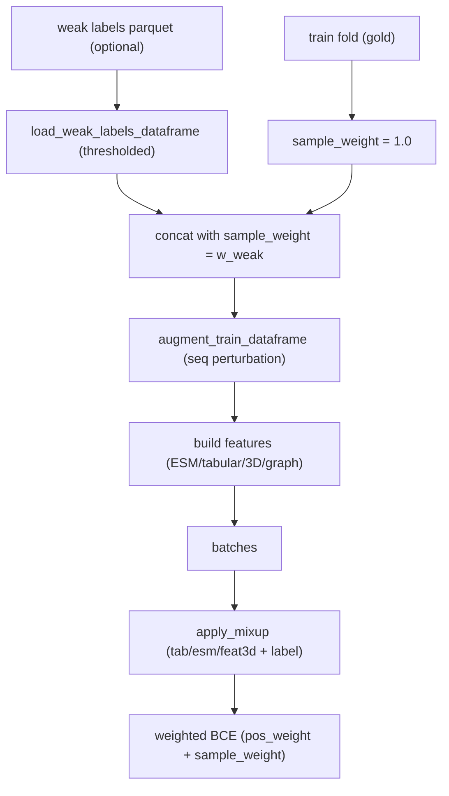

# Data Augmentation for the BBB Classifier

> Status: IMPLEMENTED. Describes the augmentation, mixup, and weak-labeling features in `TFG/bbb_classifier`. Companion to [BBB_CLASSIFIER.md](BBB_CLASSIFIER.md).

The gold dataset is small (~hundreds of peptides, ~418 training samples per fold). To get a more robust, better-calibrated classifier without changing the architecture, three cheap augmentation strategies are available and composable, all opt-in via the experiment YAML:

1. sequence-level perturbation,
2. embedding-space mixup,
3. weak-label pretraining signal with sample weighting.



## 1. Sequence-level perturbation (`data/augment.py`)

Configured by `AugmentConfig` and applied by `augment_train_dataframe`. It creates `n_augmented_per_sample` perturbed copies of the training set and concatenates them to the original.

### Conservative substitution (`mutate_conservative`)

Each residue can be swapped for a chemically similar one using a fixed BLOSUM-like map (`CONSERVATIVE_MAP`), e.g. `L -> {I,V,M,F}`, `K -> {R,H,E,Q}`. The number of changes is small (1 for sequences shorter than 12, else 2), so the physicochemistry and BBB label are preserved while adding realistic variation.

```43:60:TFG/bbb_classifier/src/bbb_classifier/data/augment.py
def mutate_conservative(seq: str, n_changes: int = 1, rng: random.Random | None = None) -> str:
    rng = rng or random
    if not seq:
        return seq
    seq_list = list(seq)
    positions = list(range(len(seq_list)))
    rng.shuffle(positions)
    changed = 0
    for pos in positions:
        aa = seq_list[pos]
        candidates = CONSERVATIVE_MAP.get(aa, "")
        if not candidates:
            continue
        seq_list[pos] = rng.choice(list(candidates))
        changed += 1
        if changed >= n_changes:
            break
    return "".join(seq_list)
```

### Terminal truncation (`truncate_terminal`)

Removes 1-2 residues from either terminus (respecting a `min_len` of 5), mimicking the natural length variation seen across sources.

### Composition (`augment_sequence`)

For each copy, substitution is applied with probability `seq_substitution_prob` and truncation with probability `seq_truncation_prob`. The original rows are always kept; perturbed rows are added on top. A seeded `random.Random(cfg.random_state)` keeps it reproducible.

Config keys: `enabled`, `seq_substitution_prob`, `seq_truncation_prob`, `n_augmented_per_sample`, `random_state`.

## 2. Embedding-space mixup (`train/mixup.py`)

Mixup interpolates pairs of examples in feature space and interpolates their labels, which regularizes the decision boundary and improves calibration.

```9:28:TFG/bbb_classifier/src/bbb_classifier/train/mixup.py
def apply_mixup(
    batch: dict[str, Any],
    alpha: float = 0.2,
    prob: float = 0.5,
) -> dict[str, Any]:
    if alpha <= 0 or np.random.rand() > prob:
        return batch
    y = batch["y"]
    n = y.shape[0]
    if n < 2:
        return batch
    lam = float(np.random.beta(alpha, alpha))
    perm = torch.randperm(n, device=y.device)

    out = dict(batch)
    out["y"] = lam * y + (1.0 - lam) * y[perm]
    for key in ("tab", "esm", "feat3d"):
        if key in out and out[key] is not None:
            out[key] = lam * out[key] + (1.0 - lam) * out[key][perm]
    return out
```

Notes:
- mixing coefficient `lam ~ Beta(alpha, alpha)`; applied per batch with probability `prob`.
- mixes the continuous modalities `tab`, `esm`, `feat3d` and the label.
- **graphs are intentionally not mixed** (interpolating discrete graph structure is ill-defined), so mixup is a no-op on the GNN branch.
- Config keys (under `mixup`): `enabled`, `alpha`, `prob`.

## 3. Weak-label pretraining signal (`load_weak_labels_dataframe`)

Uses an existing model's predictions on unlabeled peptides as low-confidence ("weak") additional training data.

```119:131:TFG/bbb_classifier/src/bbb_classifier/data/augment.py
    high = float(cfg.get("high_threshold", 0.8))
    low = float(cfg.get("low_threshold", 0.2))
    weak_weight = float(cfg.get("sample_weight", 0.35))
    selected = df[(df[score_col] >= high) | (df[score_col] <= low)].copy()
    if selected.empty:
        return pd.DataFrame()
    selected[label_col] = (selected[score_col] >= high).astype(int)
    selected["sample_weight"] = weak_weight
    selected = selected[[sequence_col, label_col, "sample_weight"]].dropna().reset_index(drop=True)
    max_samples = int(cfg.get("max_samples", 0))
    if max_samples > 0 and len(selected) > max_samples:
        selected = selected.sample(n=max_samples, random_state=int(cfg.get("random_state", 42))).reset_index(drop=True)
```

- Reads a parquet with a calibrated score column (default `p_bbb_calibrated`).
- Keeps only confident predictions: score `>= high_threshold` -> label 1, score `<= low_threshold` -> label 0; the uncertain middle is discarded.
- Assigns a reduced `sample_weight` (default 0.35) so weak rows count less than gold rows.
- Optional cap `max_samples` (seeded sampling).
- Config keys (under `weak_labels`): `enabled`, `path`, `score_col`, `low_threshold`, `high_threshold`, `sample_weight`, `max_samples`, `random_state`.

## 4. Sample weighting in the loss

Weak labels (and any other reweighting) flow into a weighted BCE. Gold rows get `sample_weight = 1.0`; weak rows get the configured weight. `engine.py` passes the per-sample weights into the loss, and `losses.bce_loss` applies them:

```python
def bce_loss(logits, labels, pos_weight=None, sample_weight=None):
    if sample_weight is None:
        criterion = nn.BCEWithLogitsLoss(pos_weight=pos_weight)
        return criterion(logits, labels)
    losses = nn.functional.binary_cross_entropy_with_logits(
        logits, labels, pos_weight=pos_weight, reduction="none",
    )
    weighted = losses * sample_weight
    return weighted.mean()
```

Source: [`losses.py`](../bbb_classifier/src/bbb_classifier/train/losses.py).

`pos_weight` is still computed dynamically per batch from the label ratio (class imbalance), and is combined with the per-sample weights.

## 5. Wiring in `scripts/train.py`

Order of operations on the training fold:

1. set `sample_weight = 1.0` for gold rows;
2. load weak labels (if `weak_labels.enabled`) and concat with `sample_weight = w_weak`;
3. `augment_train_dataframe` to add perturbed sequence copies;
4. backfill any missing `sample_weight` to 1.0;
5. build features and a `TorchData` carrying `sample_weight`;
6. during training, `apply_mixup` per batch, then weighted BCE.

## 6. Experiment configurations

- `exp06_esm_tab_mlp_aug.yaml`: dataset augmentation + mixup (best CV PR-AUC 0.873, the deployed model).

## 7. Practical guidance

- Start from `exp06` (augmentation + mixup) as the robust default.
- Keep augmentation conservative: large substitution/truncation probabilities can flip the true BBB label and hurt calibration.
- Weak labels and D3 pretraining have been removed from the codebase; use gold + dataset augmentation only.
- Augmentation is applied to the **training fold only**; validation/holdout stay pristine for honest metrics.
