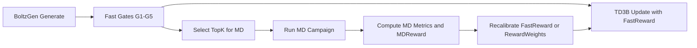

# RL + Molecular Dynamics (TD3B) — Plan operativo

## Objetivo

Definir cómo integrar **TD3B (RL amortizado)** con **Molecular Dynamics (MD)** para mejorar la priorización de péptidos en `BoltzGen` sin depender, de momento, de guidance BBB dentro de la reverse-SDE.

Este documento describe el flujo recomendado para que la señal BBB y la señal de estabilidad dinámica entren en el ciclo de optimización de forma reproducible.

## Alcance (estado actual)

- Se mantiene la separación actual:
  - Guidance geométrico en difusión: hotspots / ATP.
  - Señal BBB de secuencia/tabular: vía reward TD3B (`p_bbb_calibrated`).
- **No** se introduce aquí guidance BBB en reverse-SDE.
- MD se usa como señal de validación avanzada y como reward diferido para reentrenamiento por iteraciones.

## Idea central

Usar dos niveles de reward:

1. **Reward rápido (surrogate)** para entrenar TD3B en cada iteración con miles de candidatos.
2. **Reward MD (lento, alta fidelidad)** sobre un subconjunto top-K para corregir y recalibrar el reward rápido en ciclos sucesivos.

En práctica: TD3B optimiza con señal barata en línea; MD aporta corrección de realidad física fuera de línea.

## Flujo propuesto (outer loop)

## Diseño del reward

### 1) Reward rápido para TD3B

Reward escalar por candidato `y`:

\[
R_{\text{fast}}(y)=
w_{\text{bind}} \cdot S_{\text{bind}}
\quad + w_{\text{bbb}} \cdot p_{\text{BBB}}^{\text{cal}}
\quad + w_{\text{dir}} \cdot S_{\text{dir}}
\quad - w_{\text{atp}} \cdot P_{\text{ATP}}
\quad - w_{\text{liab}} \cdot P_{\text{liabilities}}
\]

Donde:

- `S_bind`: score de afinidad/satisfacción hotspot.
- `p_BBB_cal`: probabilidad calibrada del oracle BBB.
- `S_dir`: señal direccional (`d*`).
- `P_ATP`: penalización por cercanía al cleft ATP.
- `P_liabilities`: penalización de motivos problemáticos.

### 2) Reward MD (diferido)

Para top-K candidatos, definir:

\[
R_{\text{MD}}(y)=
v_1 \cdot \text{StabilityScore}
\quad + v_2 \cdot \text{InterfacePersistence}
\quad + v_3 \cdot \text{PocketResidency}
\quad - v_4 \cdot \text{UnfoldPenalty}
\]

Métricas sugeridas:

- **StabilityScore:** RMSD backbone péptido, variabilidad de estructura secundaria.
- **InterfacePersistence:** fracción temporal de contactos con hotspots (R96/R180/K205).
- **PocketResidency:** tiempo en región objetivo y ausencia de drift hacia ATP cleft.
- **UnfoldPenalty:** episodios de desenrollamiento/rotura de ciclo o pérdida total de interfaz.

### 3) Reward híbrido por iteración

No mezclar todo en línea desde el principio. Recomendada estrategia por etapas:

- Etapa A: entrenar con `R_fast`.
- Etapa B: ejecutar MD en top-K.
- Etapa C: ajustar pesos de `R_fast` para aproximar `R_MD` (calibración de reward).

Una forma simple:

\[
R_{\text{train}} = (1-\beta)\,R_{\text{fast}} + \beta\,\widehat{R_{\text{MD}}}
\]

donde `\widehat{R_MD}` es un predictor ligero entrenado sobre los pares `(features, R_MD)` del lote con MD.

## Integración con TD3B

## Señal de entrenamiento

Mantener la formulación de TD3B ya documentada en `THEORETICAL_FRAMEWORK.md`:

- Fine-tuning amortizado sobre muestras del prior `p_{\theta_0}`.
- Objetivo WDCE + término de control + anclaje KL al prior para evitar colapso de modos.

## Recomendación operativa

1. Generar un lote grande (`N`).
2. Aplicar gates rápidos y calcular `R_fast`.
3. Actualizar TD3B con todo el lote filtrado.
4. En paralelo, lanzar MD para top-K.
5. Cuando termina MD, recalibrar reward y ajustar pesos para la siguiente iteración.

Esto evita bloquear todo el ciclo generativo por tiempos de MD.

## Política de selección para MD

No enviar solo los mejores por un score único. Usar selección diversa:

- 50% por ranking de `R_fast` (explotación).
- 30% por frontera de Pareto (afinidad, BBB, developability, riesgo ATP).
- 20% por diversidad estructural/secuencial (exploración).

Así se reduce sesgo y se mejora cobertura del espacio químico.

## Protocolo MD mínimo recomendado

Para cada candidato top-K:

- Réplicas: 3 semillas por candidato.
- Duración:
  - screening: 50–100 ns por réplica,
  - confirmación de leads: 300–500 ns.
- Sistema:
  - solvente explícito,
  - iones fisiológicos,
  - condiciones consistentes entre iteraciones.

Guardar por réplica:

- trazas de RMSD/Rg/SASA,
- ocupación de contactos hotspot,
- distancia al ATP cleft,
- snapshots representativos.

## Criterios de avance por iteración

Una iteración RL+MD se considera válida si:

- aumenta la proporción de candidatos que pasan G1-G5;
- sube la mediana de `R_MD` en top-K respecto a la iteración previa;
- no colapsa diversidad (secuencial/estructural);
- se mantiene estabilidad de entrenamiento (sin drift excesivo por KL).

## Riesgos y mitigaciones

- **Reward hacking sobre `R_fast`:** recalibrar con `R_MD` en cada ciclo.
- **Costo computacional de MD:** top-K pequeño y campañas asíncronas.
- **Sobreajuste a una sola métrica de MD:** usar score compuesto, no un único endpoint.
- **Pérdida de diversidad:** cuota explícita de exploración y clustering.
- **No reproducibilidad:** fijar seeds, versiones de FF, protocolos y rutas de artefactos.

## Entregables sugeridos (documentación + artefactos)

- `iteration_{i}/candidates.parquet` (scores rápidos + metadata).
- `iteration_{i}/md_results.parquet` (métricas agregadas por réplica/candidato).
- `iteration_{i}/reward_calibration.json` (pesos actualizados).
- `iteration_{i}/td3b_train_report.md` (curvas, KL, estabilidad).

## Plan de adopción en 3 pasos

1. **Baseline TD3B sin MD en el loop**  
   Confirmar estabilidad y métricas base.

2. **MD offline de top-K + análisis retrospectivo**  
   Medir correlación entre `R_fast` y `R_MD`.

3. **Cierre de loop RL+MD**  
   Recalibrar reward por iteración y repetir campañas.

---

Referencias internas:

- [THEORETICAL_FRAMEWORK.md](THEORETICAL_FRAMEWORK.md)
- [architecture.md](architecture.md)
- [AGENT_CONTEXT.md](AGENT_CONTEXT.md)
