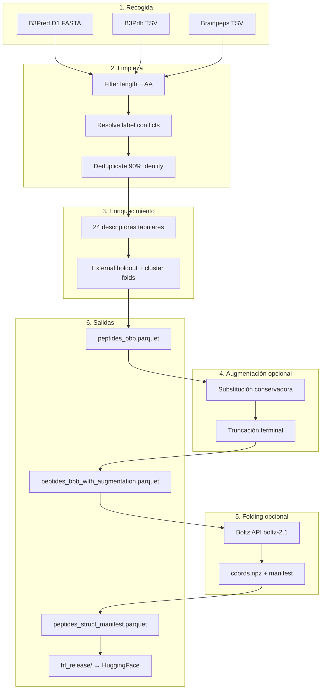
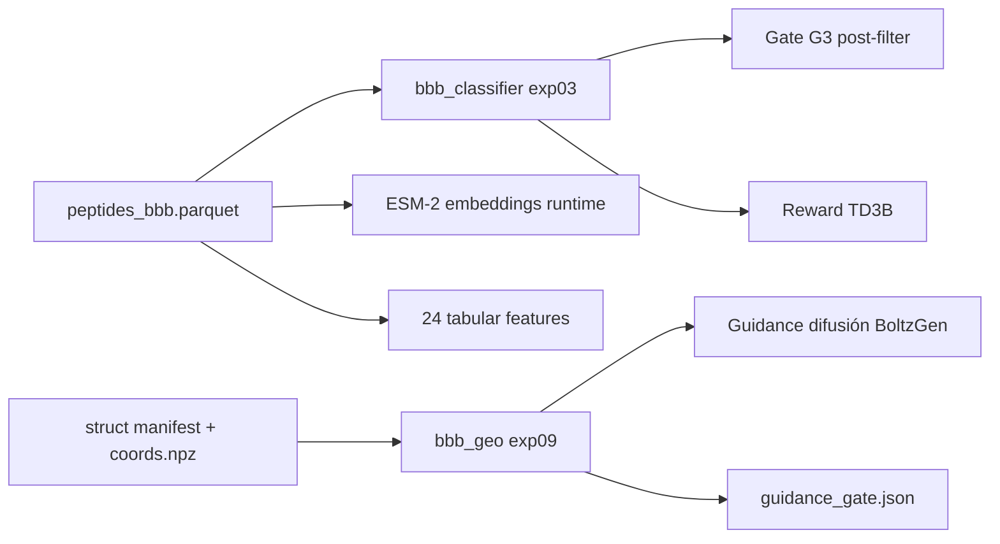

# Pipeline de datos BBB: recogida, limpieza, augmentación, features y folding

Documento de referencia para la **Fase 1** del TFG: construcción del dataset curado de péptidos con etiqueta de permeabilidad a la barrera hematoencefálica (BBB), usado para entrenar `bbb_classifier` (exp03) y `bbb_geo` (exp09).

Relacionado: [boltz-folding.md](boltz-folding.md), [bbb-classifier.md](../models/bbb-classifier.md), [structural-classifier.md](../models/structural-classifier.md), [post-filtering-five-gates.md](../models/post-filtering-five-gates.md).

---

## 1. Visión general

El paquete `bbb-dataset` (`packages/dataset/`) transforma fuentes públicas heterogéneas en tablas parquet listas para ML, con splits anti-fuga, descriptores tabulares, augmentación opcional y estructuras 3D vía Boltz API.



**Principio de diseño:** la secuencia es la unidad primaria; la estructura 3D se genera **offline una vez** (no en inferencia BoltzGen). El clasificador de secuencia (exp03) y el EGNN geométrico (exp09) consumen artefactos distintos del mismo pipeline.

---

## 2. Fuentes de datos

Implementación: `bbb_dataset.sources.SourceRegistry`

| Fuente | `source_db` | Etiqueta | Tier | Split nativo |
|--------|---------------|----------|------|--------------|
| **B3Pred D1** | `B3Pred_D1` | ± BBB (FASTA pos/neg train+val) | gold | train / val |
| **B3Pdb** | `B3Pdb` | positivos (TSV local) | gold | train |
| **Brainpeps** | `Brainpeps` | ± si hay columna label (TSV local) | silver | train |

### 2.1 B3Pred D1 (núcleo gold)

Descarga automática desde el servidor B3Pred si faltan los FASTA en `data/raw/`:

- `b3pred_pos_train.fa`, `b3pred_pos_val.fa`
- `b3pred_neg_train.fa`, `b3pred_neg_val.fa`

Cada registro FASTA produce:

```python
{
    "source_id": record.id,
    "sequence": str(record.seq).upper(),
    "length": len(sequence),
    "bbb_label": 0 | 1,
    "source_db": "B3Pred_D1",
    "split": "train" | "val",
    "source_split": "train" | "val",
    "label_tier": "gold",
}
```

El split **val** de B3Pred se reserva como **holdout externo** (`external_test = 1`).

### 2.2 B3Pdb y Brainpeps (expansión opcional)

Archivos locales esperados:

- `data/raw/b3pdb.tsv` — péptidos BBB+ curados (positivos)
- `data/raw/brainpeps.tsv` — péptidos cerebrales (silver; label si disponible)

Si el archivo no existe, la fuente se omite silenciosamente (DataFrame vacío).

### 2.3 Fuentes exclidas deliberadamente

- **UniProt / PDB cross-refs** — fuera de alcance (ver `DATA_CARD.md`)
- Secuencias con aminoácidos no canónicos (D-aminoácidos, modificaciones) — filtradas en limpieza

---

## 3. Limpieza y deduplicación

Implementación: `bbb_dataset.cleaning.SequenceCleaner`

Pipeline secuencial en `run()`:

### 3.1 Filtro de secuencia

\[
\mathcal{S}_{\mathrm{valid}} = \left\{ s \;\middle|\; L_{\min} \le |s| \le L_{\max},\; s \subseteq \Sigma_{20} \right\}
\]

Defaults: \(L_{\min} = 6\), \(L_{\max} = 30\), \(\Sigma_{20}\) = aminoácidos canónicos (`bbb_dataset.aa.CANONICAL_AA`).

Estadísticas emitidas: `rows_drop_length`, `rows_drop_noncanonical`.

### 3.2 Resolución de conflictos de etiqueta

Si la misma secuencia aparece con `bbb_label = 0` y `bbb_label = 1` tras merge de fuentes, **se elimina por completo**:

\[
s \in \mathcal{S} \;\Rightarrow\; \nexists\, \text{fuente}_i, \text{fuente}_j : y_i(s) \neq y_j(s)
\]

### 3.3 Deduplicación por identidad de secuencia

Tres pasos:

1. **Dedup exacto** — `(sequence, bbb_label)` únicos
2. **Clustering** a umbral \(\theta = 0.9\) (90% identidad global alineada posición a posición)
3. **Representante por cluster** — se conserva la fila con `bbb_label = 1` preferida (`sort_values label desc`)

Clustering con herramientas externas si están en PATH:

```
cd-hit -c 0.9   → preferido
mmseqs cluster --min-seq-id 0.9   → fallback
_cluster_python   → fallback puro Python O(n²)_
```

La columna `cluster_id` queda en el dataset gold para splits group-aware.

---

## 4. Extracción de features tabulares

Implementación: `bbb_dataset.features.FeatureComputer`

Para cada secuencia \(s\), `compute_features(s)` devuelve **24 descriptores** usados por `exp03_esm_tab_mlp`:

| Grupo | Features | Librería |
|-------|----------|----------|
| Masas / carga | `mw`, `mw_pyteomics`, `mw_delta_abs`, `pi`, `net_charge_ph7`, `total_charge`, `charge_density` | modlamp, pyteomics |
| Hidrofobicidad | `hydrophobic_ratio_pct`, `mean_hydrophobicity`, `hydrophobicity_ph7`, `hydrophilic_ratio`, `gravy`, `boman_index`, `aliphatic_index` | modlamp, BioPython |
| Composición AA | `aa_basic_pct`, `aa_acidic_pct`, `aa_aromatic_pct`, `aa_hydrophobic_pct`, `aa_polar_pct`, `aromaticity` | custom fractions |
| Estabilidad / óptica | `instability_index`, `ext_coef_reduced`, `ext_coef_oxidized` | BioPython |
| Anfitipatidad 1D | `hydrophobic_moment` | Eisenberg scale, ángulo 100° |

**Momento hidrofóbico secuencial** (proxy 1D, distinto del potencial 3D en `bbb_geo`):

\[
\mu_{\mathrm{1D}} = \frac{1}{L}\sqrt{\left(\sum_i h_i \cos(i\theta)\right)^2 + \left(\sum_i h_i \sin(i\theta)\right)^2}, \quad \theta = 100°
\]

Los features se recalculan automáticamente tras augmentación (`Augmenter` → `FeatureComputer.add_columns`).

**Nota:** ESM-2 embeddings (\(d = 128\)) **no** se calculan en este pipeline; los genera `bbb_classifier` en tiempo de entrenamiento/predict sobre la columna `sequence`.

---

## 5. Splits y anti-fuga

Implementación: `bbb_dataset.splits.FoldSplitter`

### 5.1 Holdout externo

\[
\text{external\_test} = \mathbb{1}[\texttt{split} = \texttt{val}]
\]

Reserva el validation set nativo de B3Pred como evaluación final **sin mezclar** en CV interna.

### 5.2 Folds cluster-aware

Para filas con `external_test = 0`, asignación con **StratifiedGroupKFold**:

- **Estratificación:** `bbb_label` (balance positivo/negativo por fold)
- **Grupos:** `cluster_id` (secuencias ≥90% idénticas nunca en train y val simultáneamente)

\[
\text{fold\_id} \in \{0, 1, \ldots, K-1\}, \quad K = \min(5,\, |\text{clusters}|,\, n_{\min}^{\text{clase}})
\]

Si no hay suficientes grupos/clases, `fold_id = 0` para todo el subset.

**Regla para augmentación:** solo se augmentan muestras con `external_test = 0` y `fold_id ≠ 0` (evita contaminar holdout y fold 0 reservado).

---

## 6. Identificadores y schema

Tras limpieza + features + splits:

| Columna | Descripción |
|---------|-------------|
| `peptide_id` | SHA1 truncado (12 hex) de la secuencia |
| `source_id` | ID en la fuente original |
| `sequence` | Secuencia AA canónica upper |
| `length` | Longitud |
| `bbb_label` | 0 = BBB−, 1 = BBB+ |
| `source_db` | Procedencia |
| `split` / `source_split` | train / val de origen |
| `label_tier` | gold / silver / aug |
| `is_gold` | 1 para pipeline gold |
| `cluster_id` | Cluster de identidad 90% |
| `external_test` | 1 = holdout B3Pred val |
| `fold_id` | Fold CV interno (−1 holdout) |
| + 24 columnas de features | Ver §4 |

Validación: `DatasetSchema.validate()` antes de escribir parquet.

**Artefactos:**

| Archivo | Contenido |
|---------|-----------|
| `data/processed/peptides_bbb.parquet` | Gold table |
| `data/processed/peptides_bbb_preview.csv` | Preview 1000 filas |
| `data/processed/peptides_bbb_augmented_extra.parquet` | Solo filas augmentadas |
| `data/processed/peptides_bbb_with_augmentation.parquet` | Gold + augmented |
| `data/processed/augmentation_stats.json` | Contadores de augmentación |

---

## 7. Data augmentation

Implementación: `bbb_dataset.augmentation.Augmenter`
Config: `configs/augmentation.yaml`

### 7.1 Objetivo

Aumentar datos de entrenamiento con perturbaciones **conservadoras** que preservan la etiqueta BBB (misma filosofía que exp06 en el TFG legacy): mutaciones bioquímicamente plausibles, no cambios aleatorios destructivos.

### 7.2 Operadores

**Substitución conservadora** (`mutate_conservative`) — mapa `CONSERVATIVE_MAP`:

```
D → E,N,Q    K → R,H,E,Q    F → Y,W,L    ...
```

Con probabilidad `seq_substitution_prob = 0.5`, se mutan 1–2 posiciones (2 si \(|s| \ge 12\)).

**Truncación terminal** (`truncate_terminal`) — con probabilidad `seq_truncation_prob = 0.3`:

- Recorte de 1–2 residuos en N- o C-terminal
- Respeta `min_length`

### 7.3 Generación

Por cada muestra candidata (no holdout, `fold_id ≠ 0`):

\[
N_{\mathrm{aug}} = \texttt{n\_augmented\_per\_sample} = 2
\]

Se descartan variantes: duplicadas, inválidas (longitud/AA), idénticas al padre.

Metadatos de filas augmentadas:

```python
label_tier = "aug"
is_augmented = 1
parent_peptide_id = <peptide_id del padre>
source_id = f"AUG_{parent_source_id}_{aug_idx}"
bbb_label  # heredado del padre (sin relabel)
```

### 7.4 Desactivación

```yaml
enabled: false   # en augmentation.yaml
# o
uv run bbb-dataset-build --skip-augment
```

---

## 8. Folding estructural (Boltz API)

Implementación: `bbb_dataset.folding.StructureFolder`
Config: `configs/folding.yaml`
Doc operativa: [boltz-folding.md](boltz-folding.md)

### 8.1 Objetivo

Para cada secuencia única en el dataset combinado, predecir una estructura 3D monomérica (cadena A) y almacenar:

- coordenadas backbone en `coords.npz`
- métricas de confianza Boltz en el manifest

Esto alimenta el entrenamiento de **`bbb_geo`** (`exp09_struct_egnn_geo`), no el clasificador de secuencia exp03.

### 8.2 Job Boltz

Input por péptido:

```yaml
entities:
  - type: protein
    value: <SEQUENCE>
    chain_ids: ["A"]
num_samples: 1
model: boltz-2.1
```

Requisito: `BOLTZ_API_KEY` en `packages/dataset/.env.local`.

### 8.3 Layout en disco

```
boltz-experiments/bbb-fold-<sequence_hash>/
  run.json                    # status + metrics
  outputs/files/sample_*.cif

data/structures/<sequence_hash>/
  coords.npz                  # backbone parseado del CIF
```

`sequence_hash = SHA256(sequence)[:16]`

### 8.4 Resumibilidad

Con `resume: true` (default):

- Si `run.json` → `status == "succeeded"` y existe CIF → **import** sin llamar API
- Si no → `fold_sequence()` vía SDK `boltz_api.Boltz`

Modo `--manifest-only`: reconstruye manifest desde runs existentes sin API.

### 8.5 Manifest schema

`data/processed/peptides_struct_manifest.parquet`:

| Columna | Descripción |
|---------|-------------|
| `peptide_id` | ID estable del pipeline |
| `sequence` | Secuencia |
| `sequence_hash` | Hash carpeta |
| `coords_path` | Ruta absoluta a `coords.npz` |
| `plddt` | `complex_plddt × 100` (escala 0–100) |
| `ptm` | Predicted TM-score |
| `structure_confidence` | Confianza global |
| `iptm`, `complex_iplddt`, `complex_pde`, `complex_ipde` | Métricas de interfaz/complejo |
| `length` | Longitud |

### 8.6 Parsing de coordenadas

`bbb_dataset.struct_io`:

- `parse_cif_backbone(cif)` → arrays NumPy
- `write_coords_npz(path, coords)` → formato consumido por `bbb_geo` y export HF

### 8.7 Confianza estructural en downstream

Péptidos cortos (6–30 aa) suelen tener pLDDT moderado. Mitigaciones en exp09:

- peso de muestra proporcional a `plddt` (floor configurable)
- entrenamiento noise-aware con cap `coord_sigma_cap`
- opcional: filtrar manifest por umbral pLDDT

---

## 9. Export Hugging Face

CLI: `bbb-dataset-export-hf`

Variantes:

| Variant | Tabla base | Uso |
|---------|------------|-----|
| `gold` | `peptides_bbb.parquet` | Release mínimo |
| `full` | `peptides_bbb_with_augmentation.parquet` | Release con augmentación |

Output: `data/hf_release/` — merge peptides + manifest, copia estructuras/CIF, genera README del dataset ([`manumartinm/bbb-peptides`](https://huggingface.co/datasets/manumartinm/bbb-peptides)).

Publicado: **825 péptidos** con estructuras Boltz (variant full) para entrenamiento geo en Vast.

---

## 10. Orquestación CLI

Entry point unificado:

```bash
cd packages/dataset
uv sync

# Pipeline completo (augment + fold si hay BOLTZ_API_KEY)
uv run bbb-dataset-build

# Solo gold: recogida + limpieza + features + splits
uv run bbb-dataset-build --skip-augment --skip-fold

# Pasos individuales
uv run bbb-dataset-augment
uv run bbb-dataset-fold
uv run bbb-dataset-fold --manifest-only
uv run bbb-dataset-export-hf --variant full
```

Flujo interno (`bbb-dataset-build`):

```
[1/3] build_gold()     → peptides_bbb.parquet
[2/3] build_augmented() → combined parquet (opcional)
[3/3] build_manifest() → peptides_struct_manifest.parquet (opcional)
```

Parámetros globales en `BuildConfig`:

| Parámetro | Default | Rol |
|-----------|---------|-----|
| `min_length` | 6 | Filtro + augment |
| `max_length` | 30 | Filtro + augment |
| `identity_threshold` | 0.9 | Clustering dedup |
| `random_seed` | 42 | Folds + augment |
| `sources` | B3Pred + B3Pdb + Brainpeps | Fuentes activas |

---

## 11. Conexión con modelos downstream



| Artefacto | Modelo | Momento de uso |
|-----------|--------|----------------|
| `sequence` + tabular | exp03 | Train / predict / G3 |
| `coords_path` + química por residuo | exp09 | Train geo / guidance SDE |
| `fold_id`, `external_test` | ambos | CV y evaluación honesta |
| `plddt` en manifest | exp09 | Sample weighting |

---

## 12. EDA y calidad

Notebook: `packages/dataset/notebooks/eda.ipynb`

- Lee parquets procesados y release HF
- Figuras en `data/processed/eda_figures/`
- Sección GSK3β: target de diseño (independiente del dataset BBB)

Regenerar data card:

```bash
# Tras rebuild del pipeline; ver bbb_dataset.data_card si está cableado
```

---

## 13. Tests y reproducibilidad

```bash
cd packages/dataset
uv run pytest --cov=bbb_dataset --cov-fail-under=85
```

Módulos cubiertos: `sources`, `cleaning`, `features`, `augmentation`, `splits`, `folding`, `builder`, `struct_io`.

**Buenas prácticas:**

- No commitear `BOLTZ_API_KEY` ni `data/raw/` descargado si es grande (usar DVC/gitignore)
- Fijar `random_seed` y versionar `configs/*.yaml`
- Documentar versión Boltz (`boltz-2.1`) en manifest exportado

---

## 14. Referencias de código

| Componente | Ruta |
|------------|------|
| Orquestador | `packages/dataset/src/bbb_dataset/builder.py` |
| Fuentes | `packages/dataset/src/bbb_dataset/sources.py` |
| Limpieza | `packages/dataset/src/bbb_dataset/cleaning.py` |
| Features | `packages/dataset/src/bbb_dataset/features.py` |
| Augmentación | `packages/dataset/src/bbb_dataset/augmentation.py` |
| Splits | `packages/dataset/src/bbb_dataset/splits.py` |
| Folding | `packages/dataset/src/bbb_dataset/folding.py` |
| Export HF | `packages/dataset/src/bbb_dataset/export_hf.py` |
| CLI build | `packages/dataset/src/bbb_dataset/cli/build.py` |
| Config augment | `packages/dataset/configs/augmentation.yaml` |
| Config fold | `packages/dataset/configs/folding.yaml` |

---

## 15. Limitaciones y extensiones planificadas

1. **Brainpeps silver** — calidad de etiqueta inferior a B3Pred gold; usar con cautela o solo como semi-supervisado.
2. **Augmentación** — no relabela; asume label invariante bajo mutación conservadora (aproximación).
3. **Folding monómero** — no modela péptido en membrana ni unido a receptor; estructura de referencia para EGNN, no ground truth experimental.
4. **Longitud 6–30** — péptidos de diseño GSK3β (~15 aa cíclicos) caen dentro del dominio; diseños más largos quedarían fuera de distribución del oracle.
5. **Extensiones documentadas** (Cavaco BBB rules, pesos pLDDT en build, relabel tras MD) — pendientes de integrar en el builder; ver [bbb-transport-meta-analysis-2024.md](../references/papers/bbb-transport-meta-analysis-2024.md).
