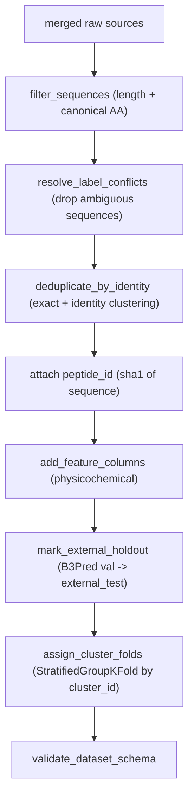

# Dataset Cleaning and Anti-Leakage Splits

> Status: IMPLEMENTED. Describes the cleaning, deduplication, and split logic in `packages/dataset/src/bbb_dataset`. Companion to [dataset-pipeline.md](dataset-pipeline.md).

The cleaning stage turns the raw, multi-source peptide tables (B3Pred D1, optional B3Pdb, Brainpeps) into a single curated table with trustworthy labels and leakage-safe cross-validation folds. It is orchestrated by `pipeline._clean_and_featurize` and lives mainly in [`clean.py`](../dataset/src/bbb_dataset/clean.py) and [`splits.py`](../dataset/src/bbb_dataset/splits.py).

## Pipeline order



## 1. Sequence filtering (`filter_sequences`)

```13:35:packages/dataset/src/bbb_dataset/clean.py
def filter_sequences(
    df: pd.DataFrame,
    sequence_col: str = "sequence",
    min_length: int = 6,
    max_length: int = 30,
    allowed_aa: set[str] | None = None,
) -> tuple[pd.DataFrame, dict[str, int]]:
```

- Upper-cases sequences.
- Keeps rows whose length is within `[min_length, max_length]` (default 6-30). The lower bound removes fragments too short to carry meaningful BBB signal; the upper bound keeps the table in the short-peptide regime targeted by the project.
- Keeps rows whose characters are all canonical amino acids (`ACDEFGHIKLMNPQRSTVWY`), dropping sequences with non-standard residues (`X`, `B`, `Z`, gaps, etc.).
- Returns stats: `rows_before_filter`, `rows_drop_length`, `rows_drop_noncanonical`, `rows_after_filter`.

## 2. Label-conflict resolution (`resolve_label_conflicts`)

A sequence that appears with **both** BBB+ and BBB- labels across sources is untrustworthy. Rather than guessing, the function **removes every sequence with more than one distinct label**:

```43:50:packages/dataset/src/bbb_dataset/clean.py
    conflict_mask = (
        df.groupby(sequence_col)[label_col]
        .nunique()
        .reset_index(name="n")
        .query("n > 1")[sequence_col]
    )
    conflict_set = set(conflict_mask.tolist())
    out = df[~df[sequence_col].isin(conflict_set)].copy().reset_index(drop=True)
```

Stats: `conflict_sequences_removed`, `rows_after_conflict_resolution`.

## 3. Identity deduplication (`deduplicate_by_identity`)

Two-step deduplication that prevents near-duplicate sequences from inflating the dataset and leaking across folds.

1. **Exact dedup**: drop rows identical in `(sequence, label)`.
2. **Identity clustering** at a configurable threshold (default `0.9`):
   - if `cd-hit` is on PATH, cluster with it and parse the `.clstr` file;
   - else if `mmseqs` is available, cluster with `mmseqs cluster` + `createtsv`;
   - else fall back to a pure-Python greedy clusterer `_cluster_python` using ungapped identity over the overlap with a length penalty.
3. **Representative selection**: within each cluster keep one row, preferring the BBB+ label (`sort_values([label_col], ascending=False)` then drop duplicates by `cluster_id`).

```200:204:packages/dataset/src/bbb_dataset/clean.py
    out = (
        out.sort_values([label_col], ascending=False)
        .drop_duplicates(subset=["cluster_id"], keep="first")
        .reset_index(drop=True)
    )
```

The `cluster_id` column is retained (`keep_cluster_id=True`) because the split stage needs it. Stats: `rows_before_identity_dedup`, `rows_after_exact_dedup`, `rows_after_identity_dedup`.

### Why identity matters for a small dataset

With only a few hundred peptides, even a handful of near-duplicate sequences spread across train and validation would let the model "memorize" rather than generalize. Clustering at 90% identity and splitting by cluster (next section) is the main defense against optimistic CV scores.

## 4. Anti-leakage splits (`splits.py`)

### External holdout (`mark_external_holdout`)

Rows whose original source split is `val` (the B3Pred validation split) are flagged `external_test = 1`. This preserves a comparison point against the published B3Pred benchmark and keeps that data out of the CV folds.

### Cluster-aware folds (`assign_cluster_folds`)

Folds are assigned with `StratifiedGroupKFold`, using:

- `y = bbb_label` for stratification (keeps class balance per fold), and
- `groups = cluster_id` so **all members of a sequence-identity cluster land in the same fold** (no near-duplicate leakage).

Only non-holdout rows (`external_test == 0`) receive a `fold_id`. The number of folds is reduced automatically when the data is too small to support `n_splits` (guards against `StratifiedGroupKFold` errors on tiny groups/classes). Rows that cannot be foldable collapse to `fold_id = 0`.

## 5. Schema validation and data card

- `schema.validate_dataset_schema` asserts required columns and integer dtypes for `bbb_label` and `fold_id`.
- `data_card.render_data_card` writes `data/processed/DATA_CARD.md` summarizing row counts, BBB+ ratio, per-source counts, and all cleaning stats above, for transparent, reproducible documentation.

## 6. Downstream contract

The cleaning stage guarantees the columns the classifier relies on: `sequence`, `bbb_label`, `split`, `cluster_id`, `external_test`, `fold_id`, plus `peptide_id` and physicochemical features. Because identity dedup and conflict resolution now happen here, the classifier's `scripts/prepare_data.py` is a passthrough (no re-deduplication), and `deduplicate_by_identity` is imported from `bbb_dataset.cleaning` by the classifier tests.
