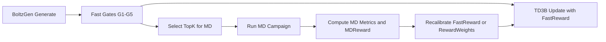

# RL + Molecular Dynamics (TD3B) — Operational Plan

## Goal

Define how to integrate **TD3B (amortized RL)** with **Molecular Dynamics (MD)** to improve peptide prioritization in BoltzGen without relying, for now, on BBB guidance inside the reverse SDE.

This document describes the recommended workflow so BBB signal and dynamic stability signal participate in the optimization loop reproducibly.

## Scope (current state)

- Current separation is maintained:
  - Geometric guidance in diffusion: hotspots / ATP.
  - Sequence/tabular BBB signal: via TD3B reward (`p_bbb_calibrated`).
- BBB guidance in reverse-SDE is **not** introduced here.
- MD is used as advanced validation and as a deferred reward for iterative retraining.

## Core idea

Use two reward levels:

1. **Fast reward (surrogate)** to train TD3B each iteration on thousands of candidates.
2. **MD reward (slow, high fidelity)** on a top-K subset to correct and recalibrate the fast reward across cycles.

In practice: TD3B optimizes with cheap online signal; MD provides physical reality correction offline.

## Proposed flow (outer loop)

## Reward design

### 1) Fast reward for TD3B

Scalar reward per candidate `y`:

\[
R_{\text{fast}}(y)=
w_{\text{bind}} \cdot S_{\text{bind}}
\quad + w_{\text{bbb}} \cdot p_{\text{BBB}}^{\text{cal}}
\quad + w_{\text{dir}} \cdot S_{\text{dir}}
\quad - w_{\text{atp}} \cdot P_{\text{ATP}}
\quad - w_{\text{liab}} \cdot P_{\text{liabilities}}
\]

Where:

- `S_bind`: affinity/hotspot satisfaction score.
- `p_BBB_cal`: calibrated BBB oracle probability.
- `S_dir`: directional signal (`d*`).
- `P_ATP`: penalty for ATP cleft proximity.
- `P_liabilities`: penalty for problematic motifs.

### 2) MD reward (deferred)

For top-K candidates, define:

\[
R_{\text{MD}}(y)=
v_1 \cdot \text{StabilityScore}
\quad + v_2 \cdot \text{InterfacePersistence}
\quad + v_3 \cdot \text{PocketResidency}
\quad - v_4 \cdot \text{UnfoldPenalty}
\]

Suggested metrics:

- **StabilityScore:** peptide backbone RMSD, secondary-structure variability.
- **InterfacePersistence:** temporal fraction of contacts with hotspots (R96/R180/K205).
- **PocketResidency:** time in target region and absence of drift toward ATP cleft.
- **UnfoldPenalty:** unfolding episodes, cyclic bond breakage, or total interface loss.

### 3) Hybrid reward per iteration

Do not mix everything inline from the start. Recommended staged strategy:

- Stage A: train with `R_fast`.
- Stage B: run MD on top-K.
- Stage C: adjust `R_fast` weights to approximate `R_MD` (reward calibration).

Simple form:

\[
R_{\text{train}} = (1-\beta)\,R_{\text{fast}} + \beta\,\widehat{R_{\text{MD}}}
\]

where `\widehat{R_MD}` is a lightweight predictor trained on `(features, R_MD)` pairs from the MD batch.

## TD3B integration

### Training signal

Keep the TD3B formulation documented in [theoretical-framework.md](../architecture/theoretical-framework.md):

- Amortized fine-tuning on samples from prior `p_{\theta_0}`.
- WDCE objective + control term + KL anchor to prior to avoid mode collapse.

### Operational recommendation

1. Generate a large batch (`N`).
2. Apply fast gates and compute `R_fast`.
3. Update TD3B with the full filtered batch.
4. In parallel, launch MD for top-K.
5. When MD finishes, recalibrate reward and adjust weights for the next iteration.

This avoids blocking the generative cycle on MD runtimes.

## MD selection policy

Do not send only the best by a single score. Use diverse selection:

- 50% by `R_fast` ranking (exploitation).
- 30% by Pareto frontier (affinity, BBB, developability, ATP risk).
- 20% by structural/sequence diversity (exploration).

This reduces bias and improves chemical space coverage.

## Minimum recommended MD protocol

For each top-K candidate:

- Replicas: 3 seeds per candidate.
- Duration:
  - screening: 50–100 ns per replica,
  - lead confirmation: 300–500 ns.
- System:
  - explicit solvent,
  - physiological ions,
  - consistent conditions across iterations.

Save per replica:

- RMSD/Rg/SASA traces,
- hotspot contact occupancy,
- distance to ATP cleft,
- representative snapshots.

## Iteration advance criteria

An RL+MD iteration is valid if:

- the fraction passing G1–G5 increases;
- median `R_MD` on top-K rises vs. the previous iteration;
- diversity (sequence/structure) does not collapse;
- training stability is maintained (no excessive KL drift).

## Risks and mitigations

- **Reward hacking on `R_fast`:** recalibrate with `R_MD` each cycle.
- **MD compute cost:** small top-K and asynchronous campaigns.
- **Overfitting to a single MD metric:** use a composite score, not one endpoint.
- **Diversity loss:** explicit exploration quota and clustering.
- **Non-reproducibility:** fix seeds, force-field versions, protocols, and artifact paths.

## Suggested deliverables (docs + artifacts)

- `iteration_{i}/candidates.parquet` (fast scores + metadata).
- `iteration_{i}/md_results.parquet` (aggregated metrics per replica/candidate).
- `iteration_{i}/reward_calibration.json` (updated weights).
- `iteration_{i}/td3b_train_report.md` (curves, KL, stability).

## Three-step adoption plan

1. **TD3B baseline without MD in the loop**
   Confirm stability and baseline metrics.

2. **Offline MD on top-K + retrospective analysis**
   Measure correlation between `R_fast` and `R_MD`.

3. **RL+MD closed loop**
   Recalibrate reward per iteration and repeat campaigns.

---

Internal references:

- [theoretical-framework.md](../architecture/theoretical-framework.md)
- [overview.md](../architecture/overview.md)
- [agent-context.md](../architecture/agent-context.md)
