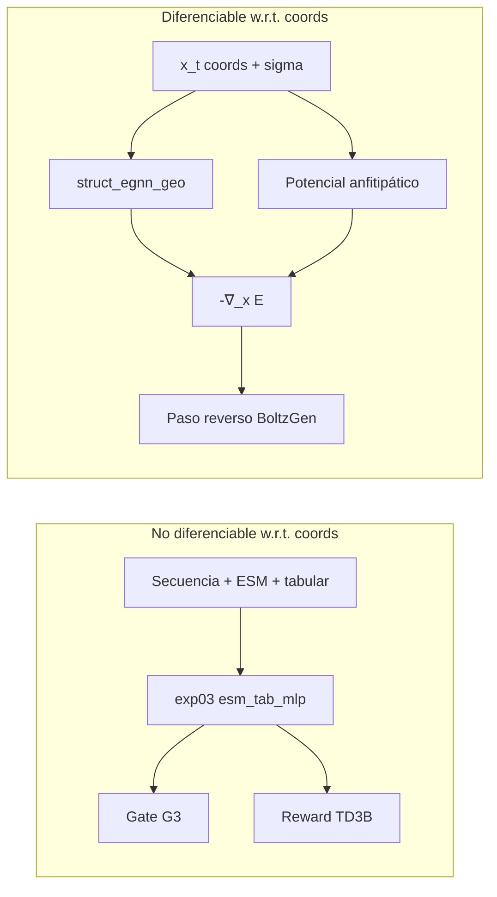

# Guía de difusión en BoltzGen con `bbb_geo`

Documento de referencia para el TFG: cómo BoltzGen genera péptidos cíclicos contra GSK3β con **guía geométrica** (hotspots + repulsión ATP) y **guía estructural BBB** (`bbb_geo` / `exp09_struct_egnn_geo`).

Relacionado: [structural-bbb-guidance.md](structural-bbb-guidance.md), [structural-classifier.md](structural-classifier.md), [theoretical-framework.md](../architecture/theoretical-framework.md).

---

## 1. Visión general

Durante el **muestreo reverso** de BoltzGen, las coordenadas atómicas \(x_t \in \mathbb{R}^{N \times 3}\) evolucionan desde ruido gaussiano hacia un complejo péptido–target. En cada paso, además del score aprendido \(s_\theta\), se inyectan fuerzas externas derivadas de energías **diferenciables respecto a \(x\)**:

| Componente | Fuente | Objetivo biológico |
|------------|--------|-------------------|
| Hotspots \(U_h\) | Potencial analítico (surco sustrato) | Acercar el péptido a R96, D180, K205 |
| Repulsión ATP \(U_a\) | Potencial LJ 12 | Evitar ocupación del cleft ATP |
| BBB geométrico \(U_{\mathrm{geo}}\) | EGNN `struct_egnn_geo` | Favorecer conformaciones con señal BBB aprendida |
| Anfitipatía \(U_{\mathrm{mem}}\) | Momento hidrofóbico 3D | Segregar cara hidrofóbica vs polar (membrana/BBB) |

La actualización combinada en código (`AtomDiffusion.sample`):

```801:818:packages/boltzgen/src/boltzgen/model/modules/diffusion.py
            denoised_over_sigma = (atom_coords_noisy - atom_coords_denoised) / t_hat
            guidance = self._compute_geometric_guidance(...)
            if guidance is not None:
                denoised_over_sigma = denoised_over_sigma + guidance
            bbb_guidance = self._compute_bbb_guidance(...)
            if bbb_guidance is not None:
                denoised_over_sigma = denoised_over_sigma + bbb_guidance
            atom_coords_next = (
                atom_coords_noisy + step_scale * (sigma_t - t_hat) * denoised_over_sigma
            )
```

---

## 2. Por qué hay dos clasificadores BBB

### 2.1 Oracle de secuencia (`bbb_classifier`, exp03)

El clasificador principal consume **secuencia discreta** + embeddings ESM-2 + descriptores tabulares globales (MW, pI, GRAVY, carga…):

\[
p_{\mathrm{BBB}}^{\mathrm{cal}} = g_{\mathrm{iso}}\!\left(\sigma\!\left(\mathrm{MLP}\big([\mathbf{h}_{\mathrm{ESM}}; \mathbf{h}_{\mathrm{tab}}]\big)\right)\right)
\]

**No es diferenciable respecto a coordenadas 3D** (la secuencia y los descriptores tabulares son constantes respecto a \(x\)). Por tanto entra solo en:

- **Gate G3** del filter cascade (\(p_{\mathrm{BBB}}^{\mathrm{cal}} \ge 0.6\))
- **Reward TD3B** (fine-tuning amortizado post-generación)

### 2.2 Guía estructural (`bbb_geo`, exp09)

`struct_egnn_geo` predice \(p_{\mathrm{geo}}(\mathrm{BBB} \mid x, \sigma)\) a partir de:

- coordenadas por residuo (CA proxy del péptido diseñado)
- química **por residuo** (hidrofobicidad Kyte–Doolittle, carga)
- grafo radius + features RBF de distancia (gradiente fluye por las distancias)

Al ser \(E(x)\) suave en coordenadas, \(\nabla_x E\) está bien definido y puede sumarse al paso de difusión **en tiempo de inferencia**, sin backpropagar por ESM.



---

## 3. Marco de difusión (BoltzGen / EDM–AF3)

BoltzGen trata el diseño como difusión sobre coordenadas atómicas con precondicionamiento EDM. En inferencia, para nivel de ruido \(\hat{t}\):

1. **Perturbación:** \(x_{\mathrm{noisy}} = x + \varepsilon\), con \(\varepsilon \sim \mathcal{N}(0, \sigma_{\mathrm{noise}}^2)\)
2. **Red:** predice \(x_0\) denoised vía `preconditioned_network_forward` con \(c_{\mathrm{in}}, c_{\mathrm{skip}}, c_{\mathrm{out}}, c_{\mathrm{noise}}\)
3. **Score implícito:**

\[
\hat{s} = \frac{x_{\mathrm{noisy}} - x_{\mathrm{denoised}}}{\hat{t}}
\]

4. **Guía externa** (este documento): \(\hat{s} \leftarrow \hat{s} + f_{\mathrm{guidance}}(x_{\mathrm{noisy}})\)

5. **Integración:**

\[
x_{t+1} = x_{\mathrm{noisy}} + \lambda_{\mathrm{step}}\,(\sigma_t - \hat{t})\,\hat{s}
\]

donde \(\lambda_{\mathrm{step}}\) es `step_scale` (puede variar por paso según schedule).

El schedule de \(\sigma\) usa dilatación temporal (`sampling_schedule: dilated`) para concentrar pasos en la fase de refinamiento estructural.

---

## 4. Guía geométrica (GSK3β)

Implementada en `_compute_geometric_guidance`. Solo actúa sobre átomos del **péptido diseñado** (`guidance_peptide_atom_mask`).

### 4.1 Energía total

\[
E_{\mathrm{geom}}(x) = E_h(x) + E_a(x)
\]

La fuerza inyectada es \(f_{\mathrm{geom}} = -\nabla_x E_{\mathrm{geom}}\) (con clamp simétrico `max_force`).

### 4.2 Hotspots — contacto con el surco de sustrato

Para cada batch, sea \(y\) el conjunto de átomos del péptido y \(H\) los átomos del target marcados como `BINDING` (hotspots en el YAML):

\[
d_H(x) = \min_{a \in y,\, r \in H} \|x_a - x_r\|
\]

Score de contacto suave (sigmoide):

\[
c_H(x) = \sigma\!\big(\alpha\,(d_{\mathrm{cutoff}} - d_H(x))\big), \quad \alpha = 8,\; d_{\mathrm{cutoff}} = 5\,\text{Å}
\]

Energía de recompensa (minimizar \(E_h\) ≡ maximizar contacto):

\[
E_h(x) = -w_h \cdot \mathbb{E}[c_H(x)], \quad w_h = \texttt{guidance\_hotspot\_weight}
\]

En el proyecto GSK3β (substrate-selective): \(H\) corresponde a residuos **96, 180, 205** (+ secundarios 67, 89, 95) definidos en `binding_types` del YAML.

### 4.3 Repulsión ATP — evitar el cleft

Sea \(A\) el conjunto de átomos del target marcados como `NOT_BINDING` / `atp_cleft`:

\[
d_A(x) = \min_{a \in y,\, r \in A} \|x_a - x_r\|
\]

Repulsión tipo Lennard-Jones (solo término \(r^{-12}\)):

\[
E_a(x) = w_a \cdot \mathbb{E}\!\left[\left(\frac{\sigma_{\mathrm{LJ}}}{d_A(x)}\right)^{12}\right], \quad w_a = \texttt{guidance\_atp\_weight},\; \sigma_{\mathrm{LJ}} = 3\,\text{Å}
\]

Valores actuales de campaña: \(w_h = 1.0\), \(w_a = 0.85\).

### 4.4 Interpretación como score guidance

En la formulación clásica de classifier-free / energy guidance:

\[
\tilde{s}_\theta(x_t) = s_\theta(x_t) + w_h \nabla_x \log p_h(x_t) - w_a \nabla_x \log p_a(x_t)
\]

Aquí \(p_h\) y \(p_a\) están implementadas como energías analíticas; el código calcula directamente \(-\nabla_x E\) vía `torch.autograd.grad`.

---

## 5. Guía BBB con `bbb_geo`

Implementada en `bbb_geo.guidance.compute_bbb_guidance_force`, invocada desde `_compute_bbb_guidance`.

### 5.1 Ventana de ruido (\(\sigma\)-gate)

La guía BBB **solo se activa en bajo ruido**:

\[
\text{activo si } \hat{t} \le \sigma_{\mathrm{gate}}, \quad \sigma_{\mathrm{gate}} = 4.0\,\text{Å (por defecto)}
\]

Motivo: a \(\sigma\) alto las coordenadas son casi ruido, los tipos de residuo del diseño aún no están fijados, y el EGNN fue entrenado en el régimen de estructuras parcialmente formadas.

### 5.2 Representación del péptido

Para cada token del `design_mask`:

1. Se agrupan átomos del residuo → centroide \(c_i \in \mathbb{R}^3\)
2. Se decodifica el aminoácido desde `res_type`
3. Se construye grafo estructural: nodos = residuos, aristas = radius graph (~10 Å), `edge_attr` = RBF de distancias

### 5.3 Energía híbrida BBB

\[
E_{\mathrm{BBB}}(x) = E_{\mathrm{geo}}(x) + E_{\mathrm{mem}}(x)
\]

**Término aprendido (EGNN):**

\[
E_{\mathrm{geo}}(x) = -w_{\mathrm{bbb}} \sum_{g} \log \sigma\!\big(f_\phi(g; x, \sigma)\big)
\]

donde \(f_\phi\) es `StructEGNNGeo`, \(g\) el grafo del péptido, y \(\log\sigma\) implementado como `F.logsigmoid(logits)`.

El modelo está condicionado en \(\sigma\) (embedding `c_noise` compatible con la familia EDM de BoltzGen), coherente con el entrenamiento **noise-aware** (ruido EDM añadido a coords durante exp09).

**Término físico (anfitipatía / membrana):**

Momento hidrofóbico 3D (estilo Eisenberg):

\[
\boldsymbol{\mu}(x) = \sum_{i=1}^{L} h_i \,(c_i - \bar{c}), \quad \bar{c} = \frac{1}{L}\sum_i c_i
\]

\[
A(x) = \|\boldsymbol{\mu}(x)\|
\]

\[
E_{\mathrm{mem}}(x) = -w_{\mathrm{mem}} \cdot A(x)
\]

con \(h_i\) = hidrofobicidad Kyte–Doolittle del residuo \(i\).

Pesos de campaña GSK3β (`guidance_feats.json`): \(w_{\mathrm{bbb}} = 0.3\), \(w_{\mathrm{mem}} = 0.7\) → la guía se apoya más en el potencial anfitipático garantizado-diferenciable, complementado por la señal aprendida del EGNN.

### 5.4 Fuerza y clamp

\[
f_{\mathrm{BBB}} = -\nabla_x E_{\mathrm{BBB}}, \quad f_{\mathrm{BBB}} \leftarrow \mathrm{clip}(f_{\mathrm{BBB}}, -F_{\max}, F_{\max})
\]

\(F_{\max} =\) `guidance_max_force` (default 1.0).

Los parámetros del EGNN se cargan con `requires_grad=False`; el gradiente fluye solo a través de \(x\) (distancias RBF, centroides, momento hidrofóbico).

---

## 6. Ecuación completa por paso de muestreo

En cada iteración \(k\) del schedule de ruido:

\[
\boxed{
\begin{aligned}
\hat{s}_k &= \frac{x_{\mathrm{noisy}} - \mathcal{D}_\theta(x_{\mathrm{noisy}}; \hat{t}_k)}{\hat{t}_k} \\
&\quad + f_{\mathrm{geom}}(x_{\mathrm{noisy}}) \\
&\quad + \mathbb{1}[\hat{t}_k \le \sigma_{\mathrm{gate}}]\, f_{\mathrm{BBB}}(x_{\mathrm{noisy}}; \hat{t}_k) \\
x_{k+1} &= x_{\mathrm{noisy}} + \lambda_{\mathrm{step},k}\,(\sigma_{k+1} - \hat{t}_k)\,\hat{s}_k
\end{aligned}
}
\]

donde \(\mathcal{D}_\theta\) es la red de difusión precondicionada de BoltzGen.

**Nota:** el paso de red corre dentro de `torch.no_grad()`; la guía reactiva `requires_grad` solo sobre una copia de coordenadas para el autograd de las energías externas.

---

## 7. Configuración en la campaña GSK3β

### 7.1 Archivos

| Archivo | Contenido |
|---------|-----------|
| `targets/gsk3b/gsk3b_peptide_design.yaml` | Scaffold cíclico, `binding_types`, proximidad, disulfuro |
| `targets/gsk3b/guidance.json` | Regiones hotspot / ATP + hiperparámetros |
| `targets/gsk3b/guidance_feats.json` | Claves `guidance_*` planas para BoltzGen |

### 7.2 Parámetros clave (`guidance_feats.json`)

| Clave | Valor GSK3β | Rol |
|-------|-------------|-----|
| `guidance_hotspot_weight` | 1.0 | Peso surco sustrato |
| `guidance_atp_weight` | 0.85 | Repulsión cleft ATP |
| `guidance_bbb_weight` | 0.3 | EGNN \(p_{\mathrm{geo}}\) |
| `guidance_membrane_weight` | 0.7 | Anfitipatía 3D |
| `guidance_bbb_sigma_gate` | 4.0 | Umbral \(\sigma\) para BBB |
| `guidance_max_force` | 1.0 | Clamp de fuerza |
| `guidance_bbb_ckpt` | path a `exp09` best.ckpt | Pesos EGNN |

### 7.3 Lanzamiento

```bash
boltzgen run targets/gsk3b/gsk3b_peptide_design.yaml \
  --output workbench/guided \
  --protocol peptide-anything \
  --config design guidance.feats_json=/abs/path/guidance_feats.json
```

El datamodule `design` inyecta las claves `guidance_*` en `feats` y deriva índices atómicos:

- `guidance_hotspot_atom_indices` ← residuos `binding` del YAML
- `guidance_atp_atom_indices` ← residuos `atp_cleft` de `guidance.json`
- `guidance_peptide_atom_mask` ← tokens con `design_mask`

---

## 8. Entrenamiento de `bbb_geo` (offline)

Antes de usar la guía en difusión, el EGNN se entrena offline:

1. **Datos:** péptidos BBB curados → estructuras Boltz (CIF/NPZ)
2. **Grafo:** nodos por residuo, aristas radius, RBF
3. **Ruido EDM:** \(\tilde{x} = x + \sigma \varepsilon\), con cap `coord_sigma_cap` (estabilidad numérica)
4. **Loss:** BCE sobre label BBB + auxiliares (anfitipatía, Rg, fracción helical proxy)
5. **Gate post-entrenamiento:** `guidance_gate.json` verifica \(\|\nabla_x \log p_{\mathrm{geo}}\|\) y correlación con anfitipatía bajo perturbaciones (`bbb-geo probe`)

Si el gate falla, se puede usar solo \(E_{\mathrm{mem}}\) en difusión y reservar \(p_{\mathrm{geo}}\) para ranking post hoc.

---

## 9. Política de fallo (fail-soft)

El sampler **no aborta** si falta un componente:

| Condición | Comportamiento |
|-----------|----------------|
| Pesos hotspot/ATP = 0 | Sin guía geométrica |
| Faltan índices atómicos | Warning, skip geométrica |
| `bbb_weight > 0` sin checkpoint | Warning, skip BBB |
| Import error `bbb_geo` | Warning, skip BBB |
| \(\sigma > \sigma_{\mathrm{gate}}\) | Skip BBB (geométrica sigue activa) |

---

## 10. Separación de responsabilidades (checklist)

| Señal | Dónde entra | ¿Gradiente en SDE? |
|-------|-------------|-------------------|
| Hotspots GSK3β | `_compute_geometric_guidance` | Sí |
| Repulsión ATP | `_compute_geometric_guidance` | Sí |
| \(p_{\mathrm{geo}}\) (EGNN) | `_compute_bbb_guidance` | Sí (bajo \(\sigma\)) |
| Anfitipatía | `_compute_bbb_guidance` | Sí (bajo \(\sigma\)) |
| \(p_{\mathrm{BBB}}^{\mathrm{cal}}\) (ESM+tabular) | Gate G3, TD3B | **No** |

Esta separación es la restricción arquitectónica central del proyecto: **no backpropagar ESM/tabular a través de coordenadas de difusión**.

---

## 11. Diagrama de flujo end-to-end

```mermaid
flowchart TD
    YAML[gsk3b_peptide_design.yaml] --> BG[BoltzGen design stage]
    FEATS[guidance_feats.json] --> BG
    CKPT[exp09 best.ckpt] --> BG

    BG --> LOOP{Paso k del schedule}
    LOOP --> NET[Red diffusion: x_noisy → x_denoised]
    NET --> SCORE["s = (x_noisy - x_denoised) / t_hat"]

    SCORE --> GEO["_compute_geometric_guidance<br/>E_h + E_a"]
    SCORE --> BBB{"sigma <= gate?"}
    BBB -->|sí| BBBF["compute_bbb_guidance_force<br/>EGNN + anfitipatía"]
    BBB -->|no| SKIP[Skip BBB]

    GEO --> SUM[s + f_geom + f_bbb]
    BBBF --> SUM
    SKIP --> SUM
    SUM --> STEP[x_{k+1} = x_noisy + step_scale * delta_sigma * s_total]
    STEP --> LOOP

    LOOP -->|fin| CAND[Candidatos generados]
    CAND --> G1[G1 hotspots]
    CAND --> G2[G2 ATP repulsion]
    CAND --> G3["G3 p_BBB^cal (exp03)"]
    CAND --> G4[G4 ipTM / pLDDT / closure]
    CAND --> G5[G5 liabilities]
```

---

## 12. Referencias de código

| Módulo | Ruta |
|--------|------|
| Sampler + hooks | `packages/boltzgen/src/boltzgen/model/modules/diffusion.py` |
| Fuerza BBB | `packages/bbb_models/src/bbb_geo/guidance.py` |
| EGNN | `packages/bbb_models/src/bbb_geo/models.py` |
| Anfitipatía | `packages/bbb_models/src/bbb_geo/features.py` |
| Config campaña | `packages/boltzgen_design/targets/gsk3b/guidance_feats.json` |
| Gates post-hoc | `packages/boltzgen_design/filtering/gates.py` |
