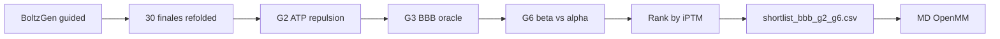

# Post-filtering: shortlist G2 + G3 + G6

Documento de referencia para la **Fase 4** del pipeline del TFG: triage post-generación sobre los **30 diseños finales** de la campaña `gsk3b_guided`, antes de MD y validación experimental.

**Gates usadas en la campaña:** solo **G2** (evitar ATP), **G3** (BBB) y **G6** (selectividad GSK3β vs GSK3α). El código implementa G1–G6 en `filtering/gates.py`, pero no forman parte del filtrado operativo documentado aquí.

Relacionado: [guidance-diffusion-bbb-geo.md](guidance-diffusion-bbb-geo.md), [theoretical-framework.md](../architecture/theoretical-framework.md), [rl-md-strategy.md](../design/rl-md-strategy.md).

---

## 1. Posición en el pipeline

Tras BoltzGen (design → inverse folding → folding → analysis → filtering nativo), la campaña deja **30 complejos refolded** en `final_ranked_designs/final_30_designs/`. El post-filtering del proyecto aplica **G2 + G3 + G6** y exporta una shortlist rankeada por **iPTM**.



| Capa | Herramienta | Rol |
|------|-------------|-----|
| **BoltzGen nativo** | step `filtering` | RMSD refolding, binding site, cisteínas, diversidad |
| **Proyecto** | `run_filter_cascade.py --require-gates g2,g3,g6` | ATP off-target, permeabilidad BBB, selectividad isoforma β/α |

---

## 2. Entradas y salidas

Script: `packages/boltzgen_design/scripts/run_filter_cascade.py`
Atajo: `packages/boltzgen_design/scripts/run_shortlist_bbb_g2_g6.sh`

| Parámetro | Descripción |
|-----------|-------------|
| `--campaign-dir` | p. ej. `packages/boltzgen/workbench/gsk3b_guided` |
| `--require-gates g2,g3,g6` | **Fijo** en la shortlist operativa |
| `--rank-by iptm` | Orden final entre pasadores |
| `--gsk3a-cif` / `--isoform-map` | Referencias G6 (`targets/gsk3a/`) |
| `--thresholds-yaml` | Umbrales G2/G3/G6 en `configs/design_campaign.yaml` |
| `--download-bbb` | Descarga oracle HF si falta checkpoint |

| Columna | Gate | Origen |
|---------|------|--------|
| `atp_repulsion` | G2 | `struct_metrics.py` sobre CIF refolded |
| `bbb_probability` | G3 | `BBBOracle` (`bbb-classifier` HF) |
| `selectivity_margin`, `alpha_contact_fraction` | G6 | `isoform_metrics.py` |
| `design_to_target_iptm` | ranking | métricas BoltzGen (no es gate dura) |

| Output | Contenido |
|--------|-----------|
| `shortlist_bbb_g2_g6_report.csv` | 30 filas con métricas y `pass_g2_atp`, `pass_g3_bbb`, `pass_g6_selectivity` |
| `shortlist_bbb_g2_g6.csv` | Candidatos que pasan G2+G3+G6, ordenados por iPTM |

---

## 3. Lógica del cascade

Un candidato entra en la shortlist solo si pasa **las tres** gates:

```
Candidato → G2 (ATP) → G3 (BBB) → G6 (β vs α) → rank by iPTM
```

Implementación: `evaluate_gates(..., require=frozenset({"g2", "g3", "g6"}))` en `filtering/gates.py`.

---

## 4. Definición de las tres gates

Umbrales de campaña (`configs/design_campaign.yaml`):

| Gate | Umbral | Métrica |
|------|--------|---------|
| **G2** | `atp_repulsion ≤ 0.15` | Repulsión del péptido respecto al bolsillo ATP |
| **G3** | `bbb_probability ≥ 0.60` | `p_bbb_calibrated` del oracle de secuencia |
| **G6** | `selectivity_margin ≥ 0.30` **y** `alpha_contact_fraction ≤ 0.35` | Preferencia geométrica β sobre α |

### G2 — Evitar el cleft ATP

**Objetivo:** descartar péptidos que ocupan el bolsillo ATP compartido (off-target vía Wnt).

Conjunto ATP \(A\) desde `targets/gsk3b/guidance.json`:

\[
A = \{50, 85, 133, 134, 135, 200, 201, 202, 203, 204, 205, 206\}
\]

\[
R_{\mathrm{ATP}} = \mathbb{E}_{r \in A}\!\left[\left(\frac{3\,\text{Å}}{d_r}\right)^{12}\right], \quad d_r = \min_{a \in \text{pep}}\|x_a - x_r\|
\]

**Condición:** \(R_{\mathrm{ATP}} \le 0.15\) (campaña; default código 0.20).

Calculado con `struct_metrics.compute_struct_metrics()` sobre cada CIF en `final_30_designs/`.

---

### G3 — Permeabilidad BBB

**Objetivo:** priorizar péptidos con probabilidad calibrada de cruzar la BBB.

**Modelo:** oracle de secuencia `bbb-classifier` (HF `manumartinm/bbb-classifier`) — **no** `bbb_geo` (solo guía en difusión).

\[
p_{\mathrm{BBB}}^{\mathrm{cal}} \ge 0.60
\]

Flujo: secuencia del diseño → `BBBOracle` → columna `bbb_probability` en el reporte.

---

### G6 — Selectividad GSK3β vs GSK3α

**Objetivo:** favorecer poses refolded compatibles con GSK3β frente a la superficie de GSK3α alineada.

**Enfoque:** proxy geométrico (sin refold GPU).

1. GSK3α desde PDB **1Q5K** (`targets/gsk3a/gsk3a.cif`), mapa β↔α en `isoform_map.json`.
2. Superposición Kabsch de α sobre la quinasa β del complejo (cadena `B`).
3. En posiciones de interfaz (≤ 12 Å del péptido), comparar distancias péptido→β vs péptido→α.

| Métrica | Definición |
|---------|------------|
| `selectivity_margin` | Fracción de posiciones donde \(d_\beta < d_\alpha\) y \(d_\beta \le 5\) Å |
| `alpha_contact_fraction` | Fracción con \(d_\alpha \le 5\) Å |

**Condición G6:**

\[
M_{\mathrm{sel}} \ge 0.30 \quad \land \quad f_{\alpha} \le 0.35
\]

El umbral 0.30 se calibró sobre los 30 finales (máximo observado ≈ 0.38). GSK3α/β comparten ~98% identidad en el dominio quinasa; la señal es principalmente **estructural**.

---

## 5. Ranking: iPTM (no Pareto)

La shortlist operativa usa `--rank-by iptm`, no el frente de Pareto multi-eje. Entre los que pasan G2+G3+G6, se ordena por `design_to_target_iptm` descendente.

El modo Pareto (`pareto.py`) sigue disponible en el script si se omite `--rank-by`; **no se usa** en la campaña `gsk3b_guided`.

---

## 6. Resultados campaña `gsk3b_guided`

Sobre **30 finales** (`final_ranked_designs/final_30_designs/`):

| Gate | Pass |
|------|------|
| G2 | 30/30 |
| G3 | 25/30 |
| G6 | 8/30 |
| **G2 + G3 + G6** | **6/30** |

**Shortlist** (`run_shortlist_bbb_g2_g6.sh`):

| id | secuencia | iPTM | selectivity_margin |
|----|-----------|------|-------------------|
| 238_1 | KLSKEGDVETWAD | 0.48 | 0.34 |
| 089_1 | LDDNIGPFGEVSD | 0.41 | 0.30 |
| 249_0 | EAGFSVGGGAPSD | 0.31 | 0.32 |
| 081_1 | GPTAEGLGGPPGS | 0.20 | 0.35 |
| 298_1 | PDNSDLVGLAPAD | 0.19 | 0.38 |
| 279_3 | PPTDFFDPGAVDA | 0.19 | 0.33 |

**Tier A** (criterios aparte: iPTM, PAE, BBB estrictos): 4 candidatos en `tier_a_candidates.csv`; solo **238_1** pasa también G6.

---

## 7. Métricas de funnel (poster / memoria)

\[
\rho_2 = \frac{N_{\mathrm{G2}}}{30}, \quad
\rho_3 = \frac{N_{\mathrm{G2 \cap G3}}}{30}, \quad
\rho_6 = \frac{N_{\mathrm{G2 \cap G3 \cap G6}}}{30}
\]

En la campaña guided: \(\rho_2 = 100\%\), \(\rho_3 = 83\%\), \(\rho_6 = 20\%\) (6/30).

---

## 8. Ejecución

Preparar GSK3α (one-time, requerido para G6):

```bash
uv run python packages/boltzgen_design/scripts/build_gsk3a_target.py
```

Shortlist G2 + G3 + G6:

```bash
bash packages/boltzgen_design/scripts/run_shortlist_bbb_g2_g6.sh
```

Equivalente manual:

```bash
uv run python packages/boltzgen_design/scripts/run_filter_cascade.py \
  --campaign-dir packages/boltzgen/workbench/gsk3b_guided \
  --require-gates g2,g3,g6 \
  --rank-by iptm \
  --download-bbb \
  --output-csv packages/boltzgen/workbench/gsk3b_guided/shortlist_bbb_g2_g6.csv
```

---

## 9. Referencias de código

| Componente | Ruta |
|------------|------|
| Gates G2, G3, G6 | `packages/boltzgen_design/filtering/gates.py` |
| Métrica G2 | `packages/boltzgen_design/filtering/struct_metrics.py` |
| Métrica G6 | `packages/boltzgen_design/filtering/isoform_metrics.py` |
| Oracle G3 | `packages/boltzgen_design/scoring/bbb_oracle.py` |
| Script + carga CIFs | `packages/boltzgen_design/scripts/run_filter_cascade.py`, `filtering/candidates.py` |
| Target GSK3α | `packages/boltzgen_design/targets/gsk3a/` |
| Umbrales | `packages/boltzgen_design/configs/design_campaign.yaml` |
| Shell shortlist | `packages/boltzgen_design/scripts/run_shortlist_bbb_g2_g6.sh` |

---

## 10. Limitaciones

1. **G6 es proxy geométrico** — no refold contra GSK3α; identidad α/β ~98% limita la señal.
2. **G2/G3/G6 no sustituyen** el filtro nativo de BoltzGen (refolding RMSD, binding site, etc.).
3. **iPTM no es gate** — solo desempata la shortlist; no se exige umbral duro de confianza estructural en este filtrado.
4. **Pre-experimental** — validación wet-lab pendiente (PAMPA, kinase assay, etc.).
