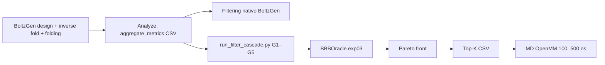
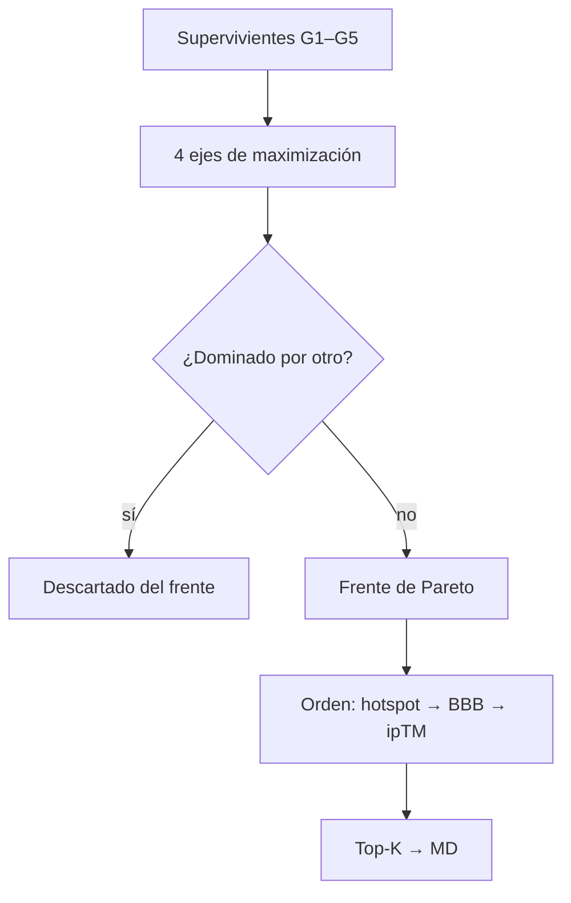

# Post-filtering: cascade de 5 gates y ranking Pareto

Documento de referencia para la **Fase 4** del pipeline del TFG: triage post-generación de candidatos BoltzGen contra GSK3β, antes de MD y validación experimental.

Relacionado: [guidance-diffusion-bbb-geo.md](guidance-diffusion-bbb-geo.md), [theoretical-framework.md](../architecture/theoretical-framework.md), [rl-md-strategy.md](../design/rl-md-strategy.md).

---

## 1. Posición en el pipeline

Tras la generación guiada (BoltzGen + hotspots + `bbb_geo` + TD3B opcional), el proyecto produce del orden de **10⁴–10⁵** estructuras candidatas. El post-filtering comprime ese espacio a **10–30** leads priorizados para MD.



Hay **dos capas** de filtrado:

| Capa | Herramienta | Rol |
|------|-------------|-----|
| **BoltzGen nativo** | `filtering` step + `filter.ipynb` | Calidad física, refolding RMSD, diversidad de secuencia, liabilities integradas |
| **Proyecto (G1–G5)** | `run_filter_cascade.py` | Criterios farmacológicos del TFG: surco sustrato, ATP, BBB, confianza estructural, desarrollabilidad |

El cascade G1–G5 es **auditable y específico del target GSK3β**; no sustituye el filtro de BoltzGen sino que añade restricciones de diseño terapéutico.

---

## 2. Entradas y salidas

### 2.1 Entradas

Script: `packages/boltzgen_design/scripts/run_filter_cascade.py`

| Input | Descripción |
|-------|-------------|
| `--input-dir` | Directorio con CIFs de diseño y/o `aggregate_metrics*.csv` de Analyze |
| `--bbb-run-dir` | Artefacto entrenado `exp03_esm_tab_mlp` (oracle secuencia) |
| `--bbb-repo` | Raíz de `bbb_models` (default vía `utils.paths`) |
| `--top-k` | Candidatos finales a exportar (default 30) |

Columnas esperadas en métricas (con aliases):

| Columna canónica | Aliases aceptados |
|------------------|-------------------|
| `hotspot_fraction` | `g1_hotspot_fraction` |
| `atp_repulsion` | `g2_atp_repulsion` |
| `iptm` | `design_iptm` |
| `plddt` | `design_plddt` |
| `closure_rmsd` | `cyclic_closure_rmsd` |
| `structure_path` | `path`, `name` (+ extensión `.cif`) |

Si no hay CSV de métricas, el script lista todos los `.cif` del directorio y extrae secuencias del archivo.

### 2.2 Salidas

| Output | Contenido |
|--------|-----------|
| `{output}.bbb.csv` | Scores del oracle BBB por secuencia |
| `{output}.csv` | Top-K del frente de Pareto tras pasar G1–G5 |

---

## 3. Lógica del cascade (fail-fast secuencial)

Cada candidato debe pasar **todas** las gates en orden. La primera que falla descarta el diseño (sin evaluar las siguientes):

```
Candidato → G1 → G2 → G3 → G4 → G5 → Ejes Pareto → Frente Pareto → Top-K
```

Implementación en `filtering/gates.py`:

```python
for row in rows:
    if not gate_g1(row, thresholds): continue
    if not gate_g2(row, thresholds): continue
    if not gate_g3(row, thresholds): continue
    if not gate_g4(row, thresholds): continue
    if not gate_g5(row): continue
    # ... asignar ejes Pareto
```

---

## 4. Las 5 gates (definición matemática)

Umbrales por defecto en código (`GateThresholds`):

```python
g1_hotspot_fraction_min = 0.70
g2_atp_repulsion_max   = 0.20
g3_bbb_min             = 0.60
g4_iptm_min            = 0.75
g4_plddt_min           = 85.0
g4_closure_rmsd_max    = 1.2   # Å
```

La campaña GSK3β en `configs/design_campaign.yaml` propone umbrales **más estrictos** (documentación operativa; el script usa defaults de `gates.py` salvo que se cableen):

| Gate | Default código | Campaña YAML |
|------|----------------|--------------|
| G1 | ≥ 0.70 | ≥ 0.75 |
| G2 | ≤ 0.20 | ≤ 0.15 |
| G3 | ≥ 0.60 | ≥ 0.60 |
| G4 ipTM | ≥ 0.75 | ≥ 0.78 |
| G4 closure | ≤ 1.2 Å | ≤ 1.5 Å |

---

### G1 — Satisfacción de hotspots (surco de sustrato)

**Objetivo biológico:** el péptido debe contactar el surco de reconocimiento de sustrato de GSK3β (R96, D180, K205 + secundarios 67, 89, 95), coherente con la estrategia substrate-selective.

**Conjunto de hotspots** \(H\) (primary + secondary desde `guidance.json`):

\[
H = \{96, 180, 205\} \cup \{67, 89, 95\}
\]

**Métrica dura (gate):** fracción de hotspots con al menos un átomo del péptido a ≤ 5 Å:

\[
f_{\mathrm{hot}} = \frac{1}{|H|}\sum_{r \in H} \mathbb{1}\!\left[\min_{a \in y}\|x_a - x_r\| \le 5\,\text{Å}\right]
\]

**Condición G1:**

\[
f_{\mathrm{hot}} \ge \tau_1, \quad \tau_1 = 0.70
\]

**Surrogate suave** (usado en guía de difusión y scoring continuo):

\[
M_{\mathrm{hot}}^{\mathrm{soft}} = \frac{1}{|H|}\sum_{r \in H} \sigma\!\left(\alpha\left(5\,\text{Å} - \min_{a \in y}\|x_a - x_r\|\right)\right), \quad \alpha = 8
\]

En inferencia, \(M_{\mathrm{hot}}^{\mathrm{soft}}\) se maximiza vía el potencial \(E_h\) de `_compute_geometric_guidance`. En post-filtering se usa la versión binaria/dura \(f_{\mathrm{hot}}\).

---

### G2 — Evitar el cleft ATP

**Objetivo biológico:** penalizar diseños que ocupan el bolsillo ATP compartido (off-target Wnt, falta de selectividad).

**Conjunto ATP** \(A\) (`atp_cleft` en `guidance.json`):

\[
A = \{50, 85, 133, 134, 135, 200, 201, 202, 203, 204, 205, 206\}
\]

**Score de repulsión** (misma familia que la guía SDE):

\[
R_{\mathrm{ATP}} = \mathbb{E}_{r \in A}\!\left[\left(\frac{\sigma_{\mathrm{LJ}}}{d_r}\right)^{12}\right], \quad d_r = \min_{a \in y}\|x_a - x_r\|, \; \sigma_{\mathrm{LJ}} = 3\,\text{Å}
\]

**Condición G2:**

\[
R_{\mathrm{ATP}} \le \tau_2, \quad \tau_2 = 0.20
\]

Valores bajos = péptido lejos del cleft. Un candidato con \(R_{\mathrm{ATP}} \gg \tau_2\) se interpreta como inhibidor ATP-competitivo no deseado.

---

### G3 — Permeabilidad BBB (oracle de secuencia)

**Objetivo biológico:** el péptido debe ser candidato a cruzar la barrera hematoencefálica (restricción translacional para Alzheimer).

**Modelo:** `exp03_esm_tab_mlp` (`bbb_classifier`) — **no** `bbb_geo` (este último solo guía difusión).

\[
p_{\mathrm{BBB}}^{\mathrm{cal}} = g_{\mathrm{iso}}\!\left(\sigma\!\left(\mathrm{MLP}\big([\mathbf{h}_{\mathrm{ESM}}; \mathbf{h}_{\mathrm{tab}}]\big)\right)\right)
\]

**Condición G3:**

\[
p_{\mathrm{BBB}}^{\mathrm{cal}} \ge \tau_3, \quad \tau_3 = 0.60
\]

**Flujo en código:**

1. Extraer secuencia del CIF (`extract_sequence_from_cif`)
2. `BBBOracle.score_sequences()` → subprocess `python -m bbb_classifier predict`
3. Columna `p_bbb_calibrated` (fallback: `p_bbb_raw`, `probability`)

**Extensiones planificadas** (documentadas, no todas implementadas en G3):

- Reglas BBB shuttle de Cavaco et al. (MW, carga, aromaticidad, % hidrofóbico)
- Checks de solubilidad / agregación tabular

---

### G4 — Confianza estructural (BoltzGen)

**Objetivo:** descartar conformaciones de baja confianza del modelo generativo o con cierre cíclico inconsistente.

**Condición G4 (conjunción — deben cumplirse las tres):**

\[
\begin{aligned}
\mathrm{ipTM} &\ge \tau_{4a} = 0.75 \\
\mathrm{pLDDT}_{\mathrm{design}} &\ge \tau_{4b} = 85 \\
\mathrm{RMSD}_{\mathrm{closure}} &\le \tau_{4c} = 1.2\,\text{Å}
\end{aligned}
\]

| Métrica | Significado |
|---------|-------------|
| **ipTM** | Confianza en la interfaz péptido–target (predicción del complejo) |
| **pLDDT** | Confianza local en la región diseñada |
| **closure_rmsd** | Desviación del puente disulfuro Cys3–Cys13 respecto al cierre ideal del péptido cíclico |

Para péptidos cíclicos con disulfuro (scaffold `2C9C2` en `gsk3b_peptide_design.yaml`), un `closure_rmsd` alto indica que el staple no cierra correctamente → inestable in vivo.

---

### G5 — Liabilities de secuencia (desarrollabilidad)

**Objetivo biológico:** eliminar motivos problemáticos para síntesis, estabilidad y toxicidad.

**Criterios documentados del TFG:**

| Riesgo | Ejemplos |
|--------|----------|
| Clusters polibásicos | `KKKK`, `RRRR` → agregación, no específico |
| Deamidación | `NG`, `NS`, `NT` |
| Oxidación | Met libre (relevante si no está en posiciones de cisteína del staple) |
| Agregación | Hotspots TANGO / TangoScan |
| Proteólisis | Sitios de corte proteasa |

**Estado actual en código** (`run_filter_cascade.py` — placeholder):

```python
df["passes_sequence_liability"] = df["sequence"].map(
    lambda s: len(s) > 0 and "KKKK" not in s and "RRRR" not in s
)
```

**Condición G5:**

\[
\text{passes\_sequence\_liability} = \text{True}
\]

BoltzGen Analyze ya calcula scores de liability por motivo (`liability_*` en `aggregate_metrics_*.csv`) cuando se configura:

```yaml
analysis liability_modality=peptide liability_peptide_type=cyclic
```

La integración completa G5 debería consumir esas columnas + TANGO en lugar del placeholder.

---

## 5. Ranking Pareto (post-gates)

Tras pasar G1–G5, los supervivientes se proyectan a **4 ejes de maximización**:

| Eje | Definición |
|-----|------------|
| `pareto_hotspot` | \(f_{\mathrm{hot}}\) |
| `pareto_atp_avoidance` | \(-R_{\mathrm{ATP}}\) (mayor = menos ATP) |
| `pareto_bbb` | \(p_{\mathrm{BBB}}^{\mathrm{cal}}\) |
| `pareto_iptm` | ipTM |

**Dominancia:**

\[
a \succ b \iff \forall i:\; a_i \ge b_i \;\land\; \exists j:\; a_j > b_j
\]

**Frente de Pareto:** conjunto de candidatos no dominados (`filtering/pareto.py`).

**Orden final** (desempate):

```python
front_df.sort_values(
    by=["pareto_hotspot", "pareto_bbb", "pareto_iptm"],
    ascending=False,
).head(top_k)
```

Interpretación: prioriza contacto con hotspots, luego BBB, luego confianza de interfaz. La evitación ATP ya filtró G2; en Pareto refina entre candidatos que pasaron el umbral duro.



---

## 6. Oracle BBB vs guía `bbb_geo`

| Artefacto | Fase | Rol en post-filtering |
|-----------|------|----------------------|
| `exp03` (`bbb_classifier`) | Post-gen | **G3** — probabilidad calibrada por secuencia |
| `exp09` (`bbb_geo`) | Difusión (bajo σ) | **No** entra en G3; solo guía geométrica durante muestreo |

No mezclar: G3 mide **entrega farmacocinética predicha por secuencia**; la guía estructural durante difusión optimiza **conformación** hacia señales BBB aprendidas en 3D.

---

## 7. BoltzGen filtering nativo (complementario)

El step `filtering` de BoltzGen (`packages/boltzgen/src/boltzgen/task/filter/filter.py`) opera sobre `aggregate_metrics_analyze.csv` con:

- Umbrales RMSD de refolding (`refolding_rmsd_threshold`, default 2.5 Å)
- `filter_bindingsite=true` → al menos un residuo del diseño cerca del sitio de unión
- `filter_cysteine=true` → conservación de cisteínas en péptidos cíclicos
- Filtro de composición aminoacídica sesgada (`filter_biased`)
- Ranking multi-métrica + selección **diversity-aware** (identidad de secuencia, parámetro `alpha`)

Config de campaña GSK3β:

```yaml
filtering filter_bindingsite=true peptide_type=cyclic filter_cysteine=true
filtering refolding_rmsd_threshold=2.5
```

**Recomendación operativa:**

1. Ejecutar pipeline BoltzGen completo (`design` → … → `filtering`)
2. Tomar el pool post-BoltzGen o `aggregate_metrics` completo
3. Aplicar `run_filter_cascade.py` con G1–G5 del proyecto
4. Exportar Top-K para MD

---

## 8. Métricas de funnel (monitorización)

Para poster / TFG, reportar tasas de supervivencia:

\[
\rho_i = \frac{N_{\mathrm{post\;G}i}}{N_{\mathrm{input}}}, \quad i = 1,\ldots,5
\]

| Métrica | Interpretación |
|---------|----------------|
| \(\rho_1\) | % con contacto suficiente al surco sustrato |
| \(\rho_2 \mid G1\) | % que además evitan ATP |
| \(\rho_3 \mid G2\) | % con BBB predicha |
| \(\rho_4 \mid G3\) | % estructuralmente confiables |
| \(\rho_5 \mid G4\) | % sin liabilities |
| \(\|F_{\mathrm{Pareto}}\|\) | Tamaño del frente antes de Top-K |

Ejemplo narrativo: *"De 60 000 diseños, 8 % pasaron G1, 3 % G1–G3, 0.4 % el cascade completo; el frente de Pareto contenía 127 candidatos, de los cuales 30 entraron a MD."*

---

## 9. Siguiente etapa: MD (fuera del cascade)

Los Top-K del CSV alimentan validación OpenMM (100 ns exploratorio, 500 ns para el lead):

| Métrica MD | Conexión con gates |
|------------|-------------------|
| Interface RMSD | Valida G4 (estructura no se deshace) |
| Persistencia de contactos hotspot | Valida G1 dinámicamente |
| Separación del cleft ATP | Valida G2 dinámicamente |
| SASA polar / estabilidad del disulfuro | Valida G4 + G5 |

Ver [rl-md-strategy.md](../design/rl-md-strategy.md) para integración MD como reward diferido en ciclos TD3B.

---

## 10. Ejecución

```bash
uv run python packages/boltzgen_design/scripts/run_filter_cascade.py \
  --input-dir workbench/gsk3b/analysis \
  --output-csv workbench/gsk3b/filtered/top30_pareto.csv \
  --bbb-run-dir packages/bbb_models/artifacts/models/exp03_esm_tab_mlp \
  --top-k 30
```

---

## 11. Referencias de código

| Componente | Ruta |
|------------|------|
| Definición gates + umbrales | `packages/boltzgen_design/filtering/gates.py` |
| Script cascade + Pareto | `packages/boltzgen_design/scripts/run_filter_cascade.py` |
| Frente de Pareto | `packages/boltzgen_design/filtering/pareto.py` |
| Oracle BBB (G3) | `packages/boltzgen_design/scoring/bbb_oracle.py` |
| Umbrales campaña | `packages/boltzgen_design/configs/design_campaign.yaml` |
| Regiones GSK3β | `packages/boltzgen_design/targets/gsk3b/guidance.json` |
| Filter nativo BoltzGen | `packages/boltzgen/src/boltzgen/task/filter/filter.py` |

---

## 12. Limitaciones actuales (honestidad metodológica)

1. **G5 simplificado** — solo rechaza `KKKK`/`RRRR`; liabilities completas pendientes de cablear desde Analyze/TANGO.
2. **Umbrales duplicados** — `gates.py` vs `design_campaign.yaml` no están unificados en un solo config cargado por el script.
3. **Métricas G1/G2** — dependen de columnas en `aggregate_metrics`; si faltan, defaults conservadores (`hotspot_fraction=0`, `atp_repulsion=1e9`) hacen que casi ningún candidato pase G1/G2.
4. **Pre-experimental** — el cascade prioriza candidatos *in silico*; eficacia sobre GSK3β y permeabilidad real requieren ensayos wet-lab (PAMPA, hCMEC/D3, kinase assay) descritos en `docs/writing/experimental-validation.tex`.
