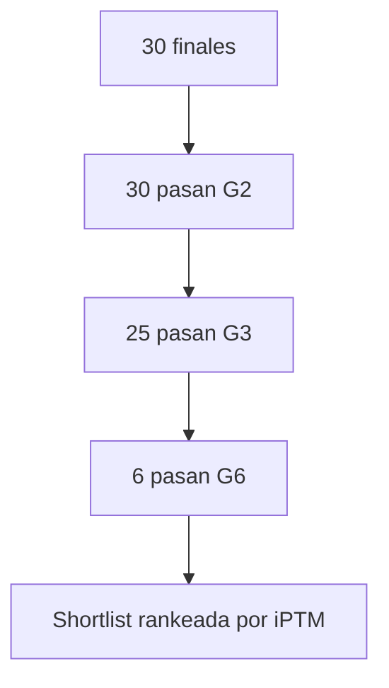

# Resultados y conclusiones — campaña `gsk3b_guided`

Documento de síntesis del post-filtrado sobre los **30 diseños finales** de la campaña BoltzGen guiada contra GSK3β (péptidos cíclicos con staple disulfuro, ~13 aa).

**Fecha de referencia:** junio 2026
**Artefactos:** `packages/boltzgen/workbench/gsk3b_guided/`
**Filtrado operativo:** gates **G2 + G3 + G6**, ranking por **iPTM**
**Detalle metodológico:** [post-filtering-five-gates.md](post-filtering-five-gates.md)

---

## 1. Contexto de la campaña

| Parámetro | Valor |
|-----------|--------|
| Target | GSK3β (PDB 1Q4L, dominio quinasa 46–220) |
| Protocolo | `peptide-anything` (BoltzGen guided) |
| Diseños analizados (pool intermedio) | 325 |
| Presupuesto final exportado | **30** complejos refolded |
| Oracle BBB (G3) | HF `manumartinm/bbb-classifier` → `p_bbb_calibrated` |
| Selectividad (G6) | Proxy geométrico GSK3β vs GSK3α (PDB 1Q5K) |

Pipeline BoltzGen: design → inverse folding → folding → analysis → filtering nativo. Sobre los 30 finales se aplicó `run_filter_cascade.py --require-gates g2,g3,g6 --rank-by iptm`.

---

## 2. Umbrales aplicados

| Gate | Criterio | Umbral campaña |
|------|----------|----------------|
| **G2** | Repulsión ATP (`atp_repulsion`) | ≤ 0.15 |
| **G3** | Probabilidad BBB calibrada | ≥ 0.60 |
| **G6** | Margen selectividad β/α | ≥ 0.30 |
| **G6** | Contacto fracción α | ≤ 0.35 |
| *(ranking)* | iPTM péptido–target | mayor es mejor (sin umbral duro) |

---

## 3. Funnel de supervivencia (n = 30)

| Etapa | Pasan | Tasa ρ |
|-------|-------|--------|
| Entrada | 30 | 100% |
| **G2** (evitar ATP) | **30** | **100%** |
| **G2 ∩ G3** (BBB) | **25** | **83%** |
| **G2 ∩ G3 ∩ G6** (selectividad β/α) | **6** | **20%** |



**Conclusión del funnel:** la generación guiada evita de forma consistente el bolsillo ATP (G2 no elimina ningún finalista). El cuello de botella principal es la **intersección BBB + selectividad isoforma**: solo 6 de 25 candidatos con BBB favorable superan también G6.

---

## 4. Estadísticas descriptivas (30 finales)

| Métrica | Mín | Mediana | Media | Máx |
|---------|-----|---------|-------|-----|
| `design_to_target_iptm` | 0.19 | 0.27 | 0.31 | **0.56** |
| `min_design_to_target_pae` (Å) | 4.97 | 11.47 | 10.95 | 16.20 |
| `bbb_probability` | 0.43 | 1.00 | 0.91 | 1.00 |
| `atp_repulsion` | ~0 | ~0 | 0.0002 | 0.003 |
| `hotspot_fraction` | 0.00 | 0.17 | 0.12 | 0.17 |
| `selectivity_margin` | 0.08 | 0.24 | 0.24 | **0.38** |
| `alpha_contact_fraction` | 0.00 | 0.34 | 0.30 | 0.53 |
| `plip_hbonds_refolded` | 0 | 2 | 2.5 | 9 |
| `delta_sasa_refolded` (Ų) | 379 | 576 | 562 | 684 |
| `closure_rmsd` disulfuro (Å) | 0.003 | 0.28 | 0.31 | 1.03 |

Observaciones:

- **iPTM moderado:** la mediana (0.27) refleja confianza de interfaz limitada en el complejo péptido–GSK3β; el máximo (0.56) no alcanza umbrales estrictos de calidad estructural (G4 no usada: ipTM ≥ 0.75).
- **BBB polarizada:** 25/30 tienen p(BBB) = 1.0; los 5 fallos de G3 tienen p(BBB) ∈ {0.43, 0.57, 0.67}.
- **Hotspots de sustrato:** `hotspot_fraction` ≤ 0.17 en todos los finales; ningún diseño contacta de forma mayoritaria el surco R96/D180/K205 (hotspots primarios de la guía).
- **Selectividad G6:** distribución estrecha (0.08–0.38); el umbral 0.30 separa ~27% del pool.

---

## 5. Shortlist final — G2 + G3 + G6 (6 candidatos)

Ordenados por iPTM (`shortlist_bbb_g2_g6.csv`):

| Rank iPTM | ID | Secuencia | iPTM | PAE (Å) | p(BBB) | Sel. margin | α-contact | H-bonds | ΔSASA (Ų) |
|-----------|-----|-----------|------|---------|--------|-------------|-----------|---------|------------|
| 1 | 238_1 | **KLSKEGDVETWAD** | **0.481** | 7.15 | 1.00 | 0.34 | 0.00 | **7** | 379 |
| 2 | 089_1 | LDDNIGPFGEVSD | 0.408 | 7.32 | 1.00 | 0.30 | 0.18 | 3 | 485 |
| 3 | 249_0 | EAGFSVGGGAPSD | 0.311 | 10.48 | 1.00 | 0.32 | 0.12 | 0 | 537 |
| 4 | 081_1 | GPTAEGLGGPPGS | 0.203 | 14.63 | 1.00 | 0.35 | 0.26 | 0 | 580 |
| 5 | 298_1 | PDNSDLVGLAPAD | 0.192 | 14.38 | 1.00 | **0.38** | 0.11 | 1 | 629 |
| 6 | 279_3 | PPTDFFDPGAVDA | 0.188 | 14.48 | 1.00 | 0.33 | 0.11 | 1 | 571 |

### Lead recomendado: `KLSKEGDVETWAD` (238_1)

- Mejor **iPTM** (0.48) y **PAE** (7.15 Å) de la shortlist.
- **p(BBB) = 1.0**, pasa G6 (margin 0.34, sin contactos α-específicos detectados).
- **7 puentes de hidrógeno** refolded (máximo del pool de shortlist).
- Único candidato **Tier A** que también pasa G6.

Candidatos 081_1, 298_1 y 279_3 maximizan selectividad G6 (margin 0.35–0.38) pero con iPTM ≤ 0.20 — útiles como contraste estructural, no como lead de afinidad.

---

## 6. Tier A vs shortlist G2+G3+G6

**Tier A** — criterios estrictos previos (iPTM, PAE ≤ 7.5, p(BBB) ≥ 0.90): **4 candidatos**

| Tier | ID | Secuencia | iPTM | PAE | p(BBB) | G6 |
|------|-----|-----------|------|-----|--------|-----|
| A1 | 238_1 | KLSKEGDVETWAD | 0.481 | 7.15 | 1.00 | **Sí** |
| A2 | 135_3 | EPEETGLGGEVSD | 0.465 | 6.23 | 1.00 | No (margin 0.15) |
| A3 | 213_1 | KPYDTYGAGEPSD | 0.436 | 6.40 | 1.00 | No (margin 0.26) |
| A4 | 109_2 | KDTREGFGGEPAE | 0.428 | 6.23 | 1.00 | No (margin 0.17) |

**Conclusión:** añadir G6 reduce Tier A de 4 a **1 candidato**. Los tres Tier A excluidos por G6 muestran `alpha_contact_fraction` elevada (0.33–0.53), compatible con poses más compatibles con la superficie α alineada que con β.

---

## 7. Trade-offs identificados

### 7.1 BBB ↔ iPTM

| ID | Secuencia | iPTM | p(BBB) | G3 |
|----|-----------|------|--------|-----|
| 238_0 | KIKKEGDTVTFAD | **0.562** | 0.43 | **No** |
| 238_1 | KLSKEGDVETWAD | 0.481 | 1.00 | Sí |

El diseño con mayor iPTM del pool (**238_0**, mutación cercana a 238_1) queda excluido por BBB. Ilustra el compromiso central del TFG: optimizar afinidad sin sacrificar permeabilidad predicha.

### 7.2 iPTM ↔ selectividad G6

Dos candidatos pasan G6 pero fallan G3 (p(BBB) < 0.60): `067_1`, `236_0`. No entran en la shortlist operativa.

### 7.3 Afinidad ↔ ocupación de hotspots

Ningún finalista alcanza ocupación sustancial del surco de sustrato (`hotspot_fraction` ≤ 17%). Los péptidos parecen unirse preferentemente en la periferia del sitio de unión definido en la guía, no en R96/D180/K205.

### 7.4 G2 (ATP)

**30/30 pasan G2** — la guía geométrica durante la generación cumple el objetivo de evitar el cleft ATP en el pool final.

---

## 8. Fallos por gate

### G3 — 5 diseños (p(BBB) < 0.60)

| ID | Secuencia | iPTM | p(BBB) |
|----|-----------|------|--------|
| 238_0 | KIKKEGDTVTFAD | 0.562 | 0.43 |
| 248_2 | TKFTDEKGGRVFK | 0.447 | 0.57 |
| 067_1 | AVGGVGIGGEPAS | 0.339 | 0.57 |
| 201_3 | SAQDGGIGAEVAD | 0.221 | 0.57 |
| 236_0 | KVTAKDGKVTGFD | 0.190 | 0.43 |

### G6 — 22 diseños (entre los 25 con G3)

Incluye los 3 Tier A restantes (135_3, 213_1, 109_2) y diseños con buen iPTM pero margin < 0.30 (p. ej. 120_2, margin 0.16).

---

## 9. Conclusiones generales

1. **Viabilidad del pipeline integrado:** es posible obtener péptidos cíclicos con p(BBB) alta, baja repulsión ATP y señal de selectividad β/α en un subconjunto pequeño pero no vacío (6/30, 20%).

2. **Lead computacional:** **KLSKEGDVETWAD** concentra el mejor equilibrio observado entre iPTM, BBB, interfaz (PAE, H-bonds) y G6; es el candidato prioritario para **MD exploratorio** y, en su caso, síntesis.

3. **Guidance ATP efectivo; hotspots de sustrato no:** G2 es trivial en finales, pero el surco de sustrato (G1, no aplicada) no se ocupa — coherente con péptidos que no cumplen la hipótesis de modulación substrate-selective estricta.

4. **G6 aporta discriminación real:** excluye 19/25 candidatos BBB+; el proxy geométrico no es redundante con G2/G3, aunque su señal es moderada por la alta identidad α/β (~98%).

5. **No hay candidato “perfecto” in silico:** iPTM máximos ~0.48–0.56, hotspots bajos, liabilities en varios diseños. El filtrado **prioriza** leads; no certifica actividad biológica.

6. **Coherencia con el marco del TFG:** el diseño dual (guidance geométrico + señal BBB/TD3B) produce candidatos BBB-competentes, pero la **validación experimental** (PAMPA, ensayo de kinase, SPR) sigue siendo necesaria.

---

## 10. Limitaciones

- Métricas de **una sola corrida** de campaña (300 diseños → 30 finales); sin réplica estadística.
- **G6 proxy geométrico**, no refold dual contra GSK3α ni ΔiPTM experimental.
- **G3** usa oracle de secuencia; no mide permeabilidad real ni estabilidad proteolítica.
- **iPTM/PAE** de BoltzGen son predictivos, no sustitutos de afinidad medida.
- Pool pequeño (n = 30) para calibrar umbrales G6.

---

## 11. Próximos pasos recomendados

| Prioridad | Acción |
|-----------|--------|
| 1 | MD OpenMM (100 ns) del lead **238_1** + control **135_3** (Tier A, falla G6) |
| 2 | Refold opcional péptido + GSK3α (Boltz) para 238_1 y 135_3 — validar G6 |
| 3 | Ensayo de kinase GSK3β/α (in vitro) sobre top 2–3 de la shortlist |
| 4 | PAMPA o equivalente para confirmar BBB en lead vs 238_0 (alto iPTM, bajo BBB) |

---

## 12. Referencia de artefactos

| Archivo | Descripción |
|---------|-------------|
| `shortlist_bbb_g2_g6.csv` | 6 candidatos shortlist |
| `shortlist_bbb_g2_g6_report.csv` | Métricas completas n = 30 |
| `tier_a_candidates.csv` | 4 Tier A con columnas G6 |
| `final_ranked_designs/final_30_designs/*.cif` | Complejos refolded |
| `final_ranked_designs/final_designs_metrics_30.csv` | Métricas BoltzGen nativas |

Comando para reproducir shortlist:

```bash
bash packages/boltzgen_design/scripts/run_shortlist_bbb_g2_g6.sh
```
