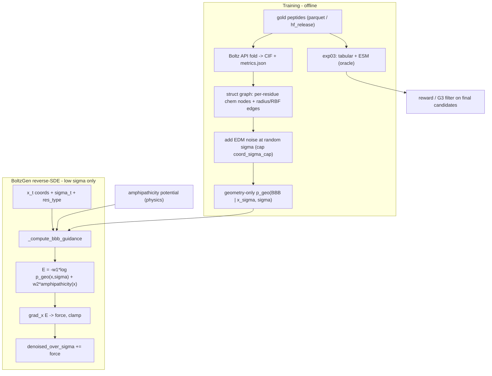

# Structural BBB Classifier as Differentiable Diffusion Guidance

> Status: **Training pipeline IMPLEMENTED** (`bbb_geo`, exp09). Diffusion hook spec + partial plumbing. Folding requires `BOLTZ_API_KEY` and API credits. BoltzGen integration pending full wiring after `guidance_gate.json` passes.

Related docs:

- [boltz-folding.md](../data/boltz-folding.md) - how the training structures are produced via the Boltz API.
- [structural-classifier.md](structural-classifier.md) - `struct_egnn_geo` (exp09), amphipathicity potential, noise-aware training, stability, post-training gates.
- [bbb-classifier.md](bbb-classifier.md) - sequence/tabular oracle (`exp03`) for reward and G3.
- [vast-training.md](../infrastructure/vast-training.md) - remote geo training on Vast.ai.

## 1. Motivation

The current BBB classifier (`bbb_classifier`, `exp03_esm_tab_mlp`) consumes a **discrete sequence** (ESM-2 embeddings) plus **tabular physicochemical descriptors**. Both are non-differentiable with respect to 3D Cartesian coordinates. As documented in [agent-context.md](../architecture/agent-context.md) and [theoretical-framework.md](../architecture/theoretical-framework.md), this is why BBB can only enter BoltzGen as:

- a hard filter (gate G3, `bbb_probability >= 0.60`), and
- a multiplicative reward factor in TD3B fine-tuning,

but **not** as a gradient during the reverse SDE, unlike the geometric hotspot/ATP potentials in [`boltzgen_design/guidance/sde_hook.py`](../boltzgen_design/guidance/sde_hook.py).

This spec removes that limitation: a classifier whose **input is 3D coordinates** is differentiable with respect to those coordinates, so its score can be injected as `-grad_x E` directly into the denoising update.

## 2. The differentiability reframe

The reverse SDE evolves continuous atom coordinates `x_t`. If the BBB energy `E(x_t)` is a smooth function of coordinates, then `grad_x E` is well defined and can be added to the denoising direction. The radius/k-NN graph topology is recomputed each step (forward only); gradients flow through the **distance / RBF edge features** (the same mechanism used by DiffDock-style models and the existing geometric guidance).

The integration point already exists in BoltzGen's sampler:

```701:710:packages/boltzgen/src/boltzgen/model/modules/diffusion.py
            guidance = self._compute_geometric_guidance(
                atom_coords=atom_coords_noisy,
                feats=feats,
                atom_mask=atom_mask,
            )
            if guidance is not None:
                denoised_over_sigma = denoised_over_sigma + guidance
            atom_coords_next = (
                atom_coords_noisy + step_scale * (sigma_t - t_hat) * denoised_over_sigma
            )
```

A parallel `_compute_bbb_guidance(...)` adds the BBB force here.

## 3. Split architecture (decided)

Two artifacts with separate jobs, so the steering signal stays purely conformational:

- **Oracle / reward / G3 filter** = fusion classifier `p(BBB | seq, tabular, ESM)` implemented as **`exp03_esm_tab_mlp`** in `bbb_classifier`. Maximum accuracy on sequence-level labels. Runs on final/decoded candidates only.
- **Diffusion guidance energy** = geometry-only term: **`struct_egnn_geo`** / `p_geo(BBB | x, sigma)` (EGNN over coordinates + per-residue chemistry, no tabular/ESM branch) plus the analytic amphipathicity potential. Being structure-only it cannot shortcut on global composition, so `grad_x` carries real signal.

> Note: an earlier fusion structural model (`struct_egnn_full`) was removed from the codebase; only `struct_egnn_geo` remains for structural training.

### Two levels of chemistry

| Source | Used by | Coordinate gradient? |
| --- | --- | --- |
| Global per-peptide tabular (`mw`, `pi`, `net_charge_ph7`, `gravy`, ... from [`tfg_bbb/features.py`](../dataset/src/tfg_bbb/features.py)) | `exp03` oracle/reward only | No (constant wrt coords) |
| Per-residue chemistry (Kyte-Doolittle, charge) | `p_geo` node features + amphipathicity potential | Yes (coupled with 3D positions) |
| Coordinates | EGNN messages | Yes |

The dataset physicochemical curation is therefore still used, but only in the oracle/reward; it is deliberately excluded from the in-diffusion guidance energy.

## 4. End-to-end flow



## 5. The deepest risk: will the gradient carry signal?

Training labels are sequence-level (every folded conformation of a BBB+ peptide is labeled 1). A classifier that can read composition can reach high accuracy while **ignoring geometry**, making `grad_x log p ~ 0` and the guidance a no-op. Mitigations, all built into the design:

1. **Geometry-only guidance model** `p_geo` with no tabular/ESM branch (nothing global to shortcut to).
2. **Hybrid energy**: add an analytic amphipathicity / 3D hydrophobic-moment potential that is guaranteed to depend on coordinates (see [structural-classifier.md](structural-classifier.md)).
3. **Multi-task + node-chemistry dropout** during training to force the latent to encode geometry.
4. **Geometry-sensitivity validation gate** (automatic in training): `guidance_gate.json` measures `||grad_x log p_geo||` and correlation with amphipathicity under perturbations. Manual probe: `scripts/geo/probe.py`. If gate fails, ship amphipathicity-only gradient and keep `p_geo` as reward-side signal.

## 6. Why a conformational BBB signal is real

For cell-penetrating / BBB-shuttle peptides, permeability correlates with **amphipathic helix formation** and a high **3D hydrophobic moment** (facial segregation of hydrophobic vs cationic residues at the membrane interface). These are genuinely conformation-dependent, so steering geometry toward higher amphipathicity is a meaningful, BBB-correlated objective rather than a tautology.

## 7. Application window

BBB guidance is applied only at **low sigma** (second half of the schedule), where the structure and the decoded `res_type` are forming. At high sigma the coordinates are near-noise and the design-position residue types are undecided, so guidance would be out-of-distribution and uninformative.

## 8. Implementation phases

1. Fold the dataset via the Boltz API -> structural manifest. See [boltz-folding.md](../data/boltz-folding.md). HF export: `tfg-bbb-export-hf`.
2. Structural graph featurizer (`bbb_geo/features/struct_graph.py`). **Done.**
3. EGNN model `struct_egnn_geo` (`bbb_geo/models/struct_egnn.py`). **Done.** (`struct_egnn_full` removed.)
4. Differentiable amphipathicity potential (`features/membrane_potential.py`). **Done.**
5. Noise-aware training (`exp09` + `scripts/geo/train.py`, `train_geo.yaml`). **Done.**
6. Geometry-sensitivity gate (`metrics_multisigma.json`, `guidance_gate.json`, `scripts/geo/probe.py`). **Done.**
7. Differentiable guidance hook in [`diffusion.py`](../boltzgen/src/boltzgen/model/modules/diffusion.py) (`_compute_bbb_guidance`, low-sigma gate, hybrid energy). **In progress.**
8. Reward/filter reuse with `exp03` oracle + fix the `p_bbb_calibrated` column bug in [`run_filter_cascade.py`](../boltzgen_design/scripts/run_filter_cascade.py).
9. Validation, tests, docs. **Ongoing** — see [vast-training.md](../infrastructure/vast-training.md) for remote training.

## 9. Integration plumbing

### 9.1 Contract (`guidance_*` keys in diffusion feats)

The `design` datamodule now injects a stable `guidance_*` contract into `feats` before sampling.

| Key | Default | Meaning |
| --- | --- | --- |
| `guidance_hotspot_weight` | `0.0` | positive geometric guidance weight |
| `guidance_atp_weight` | `0.0` | ATP-cleft repulsion weight |
| `guidance_alpha` | `8.0` | contact sigmoid slope |
| `guidance_cutoff_angstrom` | `5.0` | hotspot contact cutoff |
| `guidance_lj_sigma` | `3.0` | LJ sigma for ATP repulsion |
| `guidance_max_force` | `1.0` | clamp for injected force |
| `guidance_bbb_weight` | `0.0` | `p_geo` structural BBB weight |
| `guidance_membrane_weight` | `0.0` | amphipathicity physics weight |
| `guidance_bbb_ckpt` | `""` | checkpoint path for `bbb_geo` |
| `guidance_bbb_sigma_gate` | `4.0` | apply BBB guidance only when `sigma <= gate` |
| `guidance_bbb_hidden` | `64` | EGNN hidden size for guidance loader |
| `guidance_bbb_layers` | `3` | EGNN depth for guidance loader |

In addition, atom-level geometric indices are derived from parsed binding annotations:

- `guidance_hotspot_atom_indices` from `binding_type == BINDING`
- `guidance_atp_atom_indices` from `binding_type == NOT_BINDING`
- `guidance_peptide_atom_mask` from `design_mask` projected through `atom_to_token`

### 9.2 Activation modes

Two equivalent ways to pass guidance config into `boltzgen run`:

1. JSON file generated by campaign tooling (`guidance_feats.json`).
2. Inline Hydra overrides through `design.yaml` (`guidance.*` fields).

Example:

```bash
boltzgen run target.yaml \
  --output out/guided \
  --protocol peptide-anything \
  --config design guidance.feats_json=/abs/path/guidance_feats.json \
  --config design guidance.bbb_weight=0.3 guidance.membrane_weight=0.7 \
  --config design guidance.bbb_ckpt=/abs/path/best.ckpt guidance.bbb_sigma_gate=4.0
```

### 9.3 Failure policy (explicit no-op)

The sampler is intentionally fail-soft:

- missing hotspot/ATP indices -> geometric guidance skipped with warning.
- `guidance_bbb_weight > 0` but missing `guidance_bbb_ckpt` -> BBB guidance skipped with warning.
- `bbb_geo` import/runtime error -> BBB guidance skipped with warning.

Sampling continues without crashing; guidance falls back to no-op for that component.

## 10. Key risks

- Shortcut learning (highest) -> zero useful gradient. Mitigated by sections 5.1-5.4.
- Boltz confidence on short flexible peptides may be low -> noisy structures; mitigate with pLDDT weighting and noise-aware training.
- Boltz API dependency: needs `BOLTZ_API_KEY`, costs credits, has rate limits -> async, cached, resumable folding done once offline.
- Guidance weight tuning: too high destabilizes sampling -> start small, clamp force, low-sigma only.
- Compute: per-step GNN forward/backward inside sampling -> consider applying guidance every k steps.
